# Architecture Documentation / 아키텍처 문서

## Overview / 개요

JokboDude is an intelligent PDF processing system that filters lecture materials based on exam questions (jokbo/족보) using Google Gemini AI API. The system analyzes relationships between lecture slides and past exam questions to generate filtered PDFs containing only the most relevant study materials.

족보듀드는 Google Gemini AI API를 사용하여 시험 문제(족보)를 기반으로 강의 자료를 필터링하는 지능형 PDF 처리 시스템입니다. 이 시스템은 강의 슬라이드와 기출 문제 간의 관계를 분석하여 가장 관련성 높은 학습 자료만을 포함한 필터링된 PDF를 생성합니다.

## System Architecture / 시스템 아키텍처

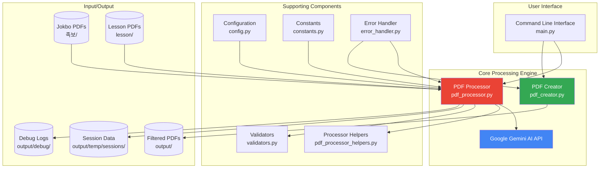

## Component Interaction Flow / 컴포넌트 상호작용 흐름

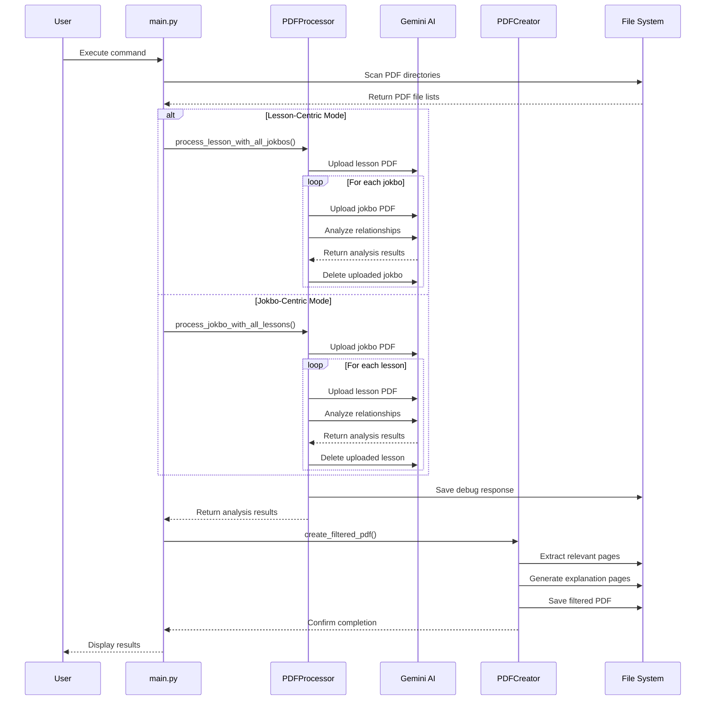

## Processing Modes / 처리 모드

### 1. Lesson-Centric Mode (Default) / 강의 중심 모드 (기본값)

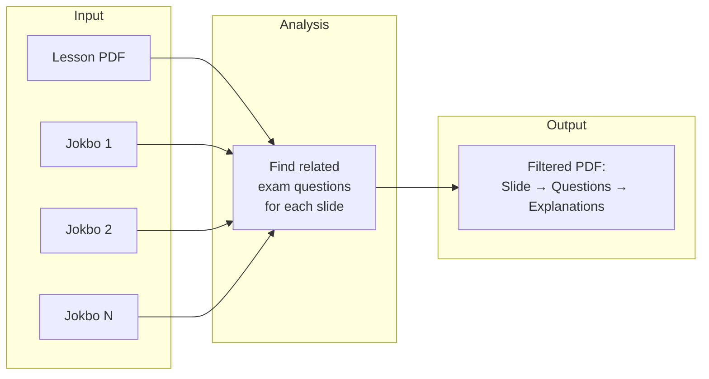

**Purpose**: Study specific lecture topics by seeing which exam questions relate to each slide.

**목적**: 각 슬라이드와 관련된 시험 문제를 확인하여 특정 강의 주제를 학습합니다.

### 2. Jokbo-Centric Mode / 족보 중심 모드

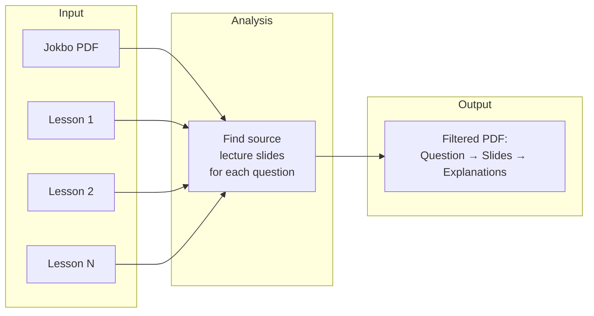

**Purpose**: Exam preparation by understanding which lecture slides are the source for each question.

**목적**: 각 문제의 출처가 되는 강의 슬라이드를 이해하여 시험을 준비합니다.

## Key Components / 주요 컴포넌트

### 1. Main Entry Point (main.py) / 메인 진입점

- **Command-line argument parsing** / 명령줄 인자 파싱
- **PDF file discovery** (filters out Zone.Identifier files) / PDF 파일 탐색 (Zone.Identifier 파일 제외)
- **Mode routing** (lesson-centric vs jokbo-centric) / 모드 라우팅 (강의 중심 vs 족보 중심)
- **Parallel processing orchestration** / 병렬 처리 조정
- **Session management** (cleanup, listing) / 세션 관리 (정리, 목록 표시)

### 2. PDF Processor (pdf_processor.py) / PDF 처리기

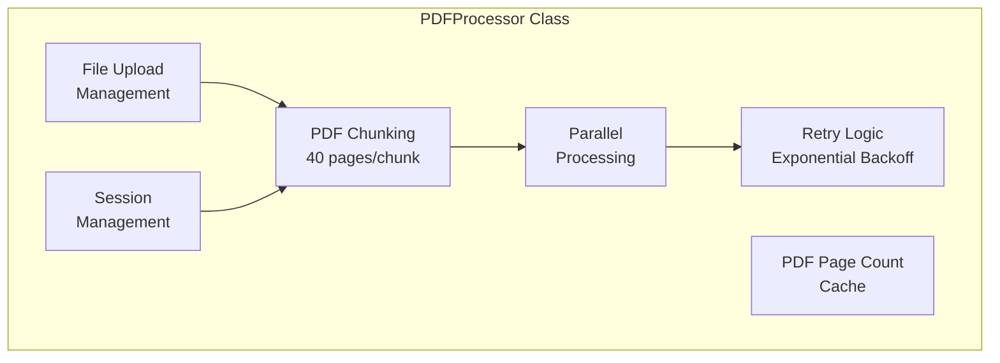

**Key Features** / 주요 기능:
- **Automatic file cleanup** after processing / 처리 후 자동 파일 정리
- **Large PDF chunking** (configurable MAX_PAGES_PER_CHUNK) / 대용량 PDF 청킹 (MAX_PAGES_PER_CHUNK 설정 가능)
- **Thread-safe caching** for concurrent access / 동시 접근을 위한 스레드 안전 캐싱
- **Session-based processing** with unique IDs / 고유 ID를 사용한 세션 기반 처리
- **Debug response saving** to output/debug/ / output/debug/에 디버그 응답 저장

### 3. PDF Creator (pdf_creator.py) / PDF 생성기

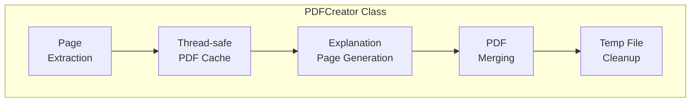

**Key Features** / 주요 기능:
- **Multi-page question extraction** with boundary detection / 경계 감지를 통한 다중 페이지 문제 추출
- **CJK font support** for Korean text / 한국어 텍스트를 위한 CJK 폰트 지원
- **Thread-safe PDF caching** with locks / 락을 사용한 스레드 안전 PDF 캐싱
- **Automatic continuation page inclusion** / 자동 연속 페이지 포함

### 4. Configuration (config.py) / 설정

- **Model selection**: Pro, Flash, Flash-lite / 모델 선택: Pro, Flash, Flash-lite
- **Generation parameters**: temperature, tokens, etc. / 생성 매개변수: 온도, 토큰 등
- **Safety settings** to prevent content blocking / 콘텐츠 차단 방지를 위한 안전 설정
- **API key management** via environment variables / 환경 변수를 통한 API 키 관리

### 5. Constants (constants.py) / 상수

- **Prompt templates** for different modes / 다양한 모드를 위한 프롬프트 템플릿
- **Relevance scoring criteria** (1-100 scale, 5-point increments) / 관련성 점수 기준 (1-100 척도, 5점 단위)
- **Output format specifications** / 출력 형식 사양
- **Processing thresholds** and limits / 처리 임계값 및 제한

## Data Flow / 데이터 흐름

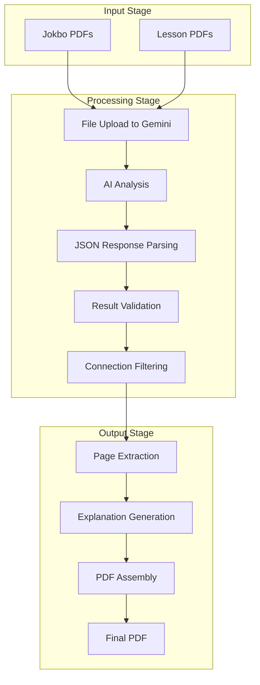

## Relevance Scoring System / 관련성 점수 시스템

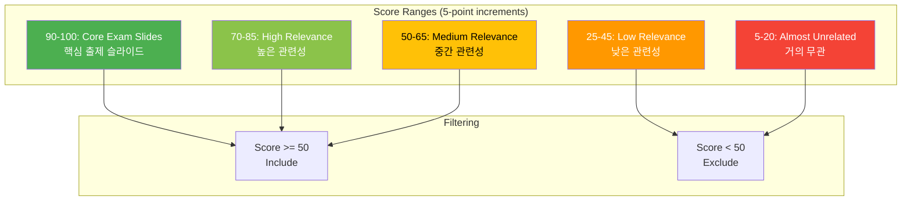

## Parallel Processing Architecture / 병렬 처리 아키텍처

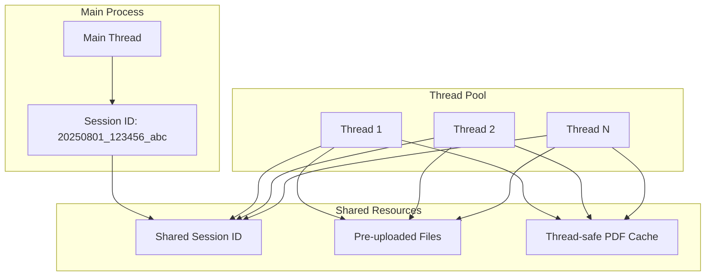

**Benefits** / 장점:
- **3x faster processing** with default 3 workers / 기본 3개 워커로 3배 빠른 처리
- **Shared session management** / 공유 세션 관리
- **Reduced API calls** through file reuse / 파일 재사용을 통한 API 호출 감소
- **Thread-safe operations** / 스레드 안전 작업

## Error Handling and Recovery / 오류 처리 및 복구

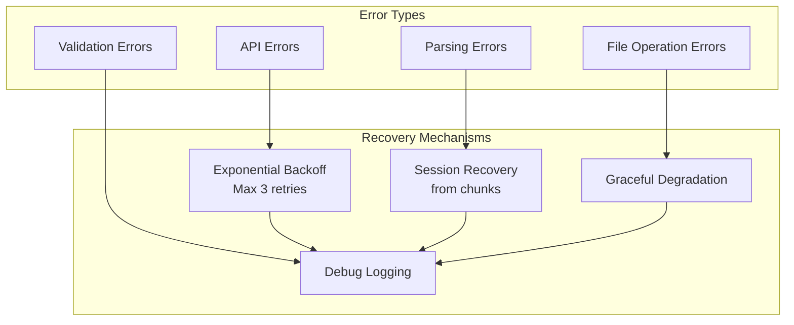

## Session Management / 세션 관리

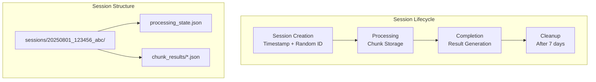

## Key Design Decisions / 주요 설계 결정

### 1. Chunking Strategy / 청킹 전략
- **40-page chunks** for optimal API performance / 최적의 API 성능을 위한 40페이지 청크
- **Configurable** via MAX_PAGES_PER_CHUNK / MAX_PAGES_PER_CHUNK를 통해 설정 가능
- **Automatic merging** of results across chunks / 청크 간 결과 자동 병합

### 2. Thread Safety / 스레드 안전성
- **PDF cache** protected by threading.Lock / threading.Lock으로 보호되는 PDF 캐시
- **Single session ID** shared across threads / 스레드 간 공유되는 단일 세션 ID
- **Independent PDFProcessor** instances per thread / 스레드별 독립적인 PDFProcessor 인스턴스

### 3. Memory Management / 메모리 관리
- **Immediate cleanup** of uploaded files / 업로드된 파일의 즉시 정리
- **Cached PDF objects** to reduce I/O / I/O 감소를 위한 캐시된 PDF 객체
- **Temporary file cleanup** in destructors / 소멸자에서의 임시 파일 정리

### 4. Reliability / 신뢰성
- **Exponential backoff** for API failures / API 실패에 대한 지수 백오프
- **Session recovery** from partial results / 부분 결과로부터의 세션 복구
- **Comprehensive error logging** / 포괄적인 오류 로깅

## Utility Scripts / 유틸리티 스크립트

### cleanup_gemini_files.py
- **Lists** uploaded Gemini files / 업로드된 Gemini 파일 목록 표시
- **Manages** API quota usage / API 할당량 사용 관리
- **Interactive** deletion options / 대화형 삭제 옵션

### cleanup_sessions.py
- **Session management** interface / 세션 관리 인터페이스
- **Shows** size, age, and status / 크기, 나이, 상태 표시
- **Bulk or selective** cleanup / 대량 또는 선택적 정리

### recover_from_chunks.py
- **Recovers** interrupted processing / 중단된 처리 복구
- **Session-aware** recovery / 세션 인식 복구
- **Chunk file** reconstruction / 청크 파일 재구성

## Performance Optimization / 성능 최적화

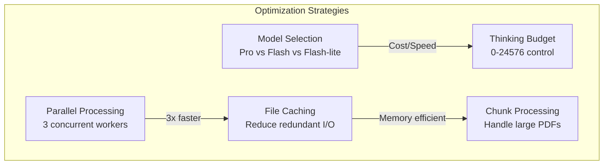

## Future Enhancements / 향후 개선사항

1. **Context Caching** implementation for cost reduction / 비용 절감을 위한 컨텍스트 캐싱 구현
2. **Async support** for better concurrency / 더 나은 동시성을 위한 비동기 지원
3. **Web interface** for easier access / 쉬운 접근을 위한 웹 인터페이스
4. **Batch processing** improvements / 배치 처리 개선
5. **Advanced filtering** options / 고급 필터링 옵션

## Technical Requirements / 기술 요구사항

- **Python 3.8+**
- **Google Gemini API key**
- **PyMuPDF** for PDF manipulation / PDF 조작을 위한 PyMuPDF
- **ReportLab** for PDF generation / PDF 생성을 위한 ReportLab
- **Threading support** for parallel processing / 병렬 처리를 위한 스레딩 지원

## Security Considerations / 보안 고려사항

- **API key** stored in environment variables / 환경 변수에 저장된 API 키
- **Temporary files** cleaned up automatically / 자동으로 정리되는 임시 파일
- **No persistent storage** of sensitive data / 민감한 데이터의 지속적 저장 없음
- **Session isolation** for multi-user scenarios / 다중 사용자 시나리오를 위한 세션 격리