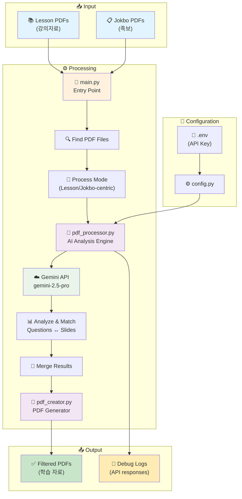
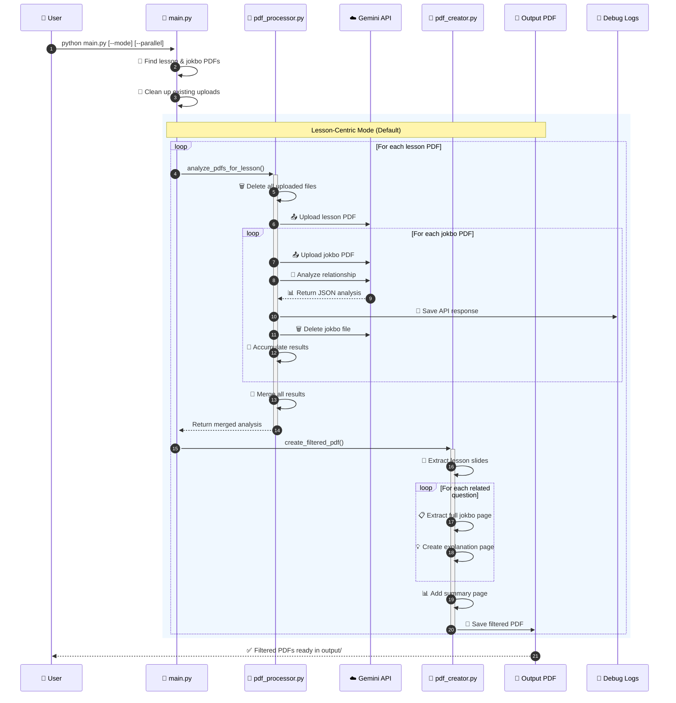
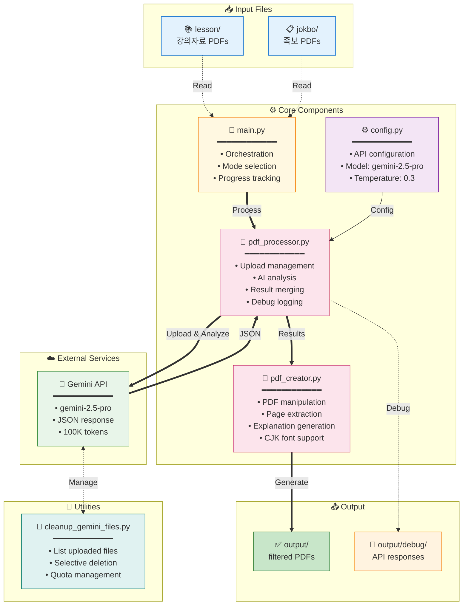
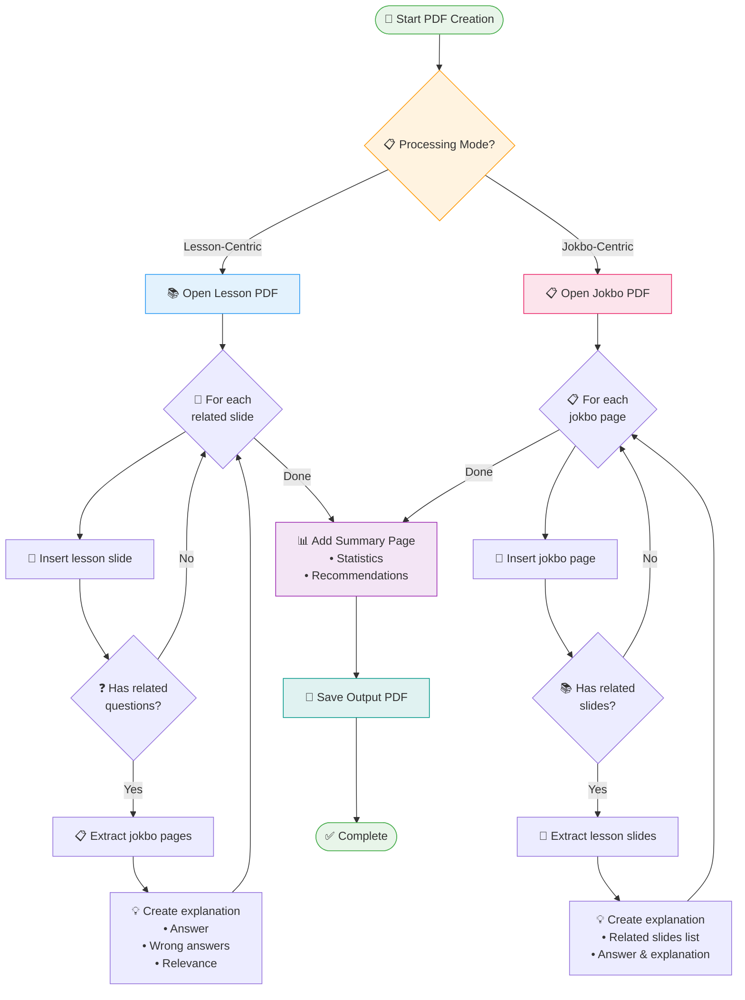

# PDF Processing System Architecture (시스템 아키텍처)

## System Overview



## Detailed Data Flow



## Component Architecture



## PDF Creation Process



## Gemini API Configuration

### Model Settings (from config.py)

```python
GENERATION_CONFIG = {
    "temperature": 0.3,          # Low temperature for consistent results
    "top_p": 0.95,              # Nucleus sampling parameter
    "top_k": 40,                # Top-k sampling parameter
    "max_output_tokens": 100000, # Maximum output tokens (very high)
    "response_mime_type": "application/json"  # Force JSON response
}

Model: gemini-2.5-pro
```

### Safety Settings

All safety categories are set to `BLOCK_NONE` to prevent content blocking:
- HARM_CATEGORY_HARASSMENT
- HARM_CATEGORY_HATE_SPEECH
- HARM_CATEGORY_SEXUALLY_EXPLICIT
- HARM_CATEGORY_DANGEROUS_CONTENT

### API Usage Pattern

1. **Upload Pattern**: One lesson PDF + One jokbo PDF at a time
2. **Request Frequency**: Sequential processing (one jokbo at a time)
3. **File Management**: 
   - Clean up all existing uploads before starting
   - Upload files as needed
   - Delete immediately after analysis
   - Retry logic for failed deletions
4. **Error Handling**: Retry logic for file processing states
5. **Debug Support**: All API responses saved to output/debug/ for troubleshooting

### Token Limits and Constraints

- **Max Output Tokens**: 100,000 tokens (configured)
- **Input Size**: Limited by PDF file upload size
- **Processing Time**: 2-second polling interval for file upload status
- **Concurrent Uploads**: Not used - sequential processing only

### Response Format

#### Lesson-Centric Mode Response
```json
{
  "related_slides": [{
    "lesson_page": number,
    "related_jokbo_questions": [{
      "jokbo_filename": string,
      "jokbo_page": number,
      "jokbo_end_page": number,  // For multi-page questions
      "question_number": number,
      "question_text": string,
      "answer": string,
      "explanation": string,
      "wrong_answer_explanations": {
        "1번": "Why option 1 is wrong",
        "2번": "Why option 2 is wrong",
        "3번": "Why option 3 is wrong",
        "4번": "Why option 4 is wrong"
      },
      "relevance_reason": string
    }],
    "importance_score": 1-10,
    "key_concepts": [string]
  }],
  "summary": {
    "total_related_slides": number,
    "total_questions": number,
    "key_topics": [string],
    "study_recommendations": string
  }
}
```

#### Jokbo-Centric Mode Response
```json
{
  "jokbo_pages": [{
    "jokbo_page": number,
    "questions": [{
      "question_number": number,
      "question_text": string,
      "answer": string,
      "explanation": string,
      "wrong_answer_explanations": {
        "1번": "...",
        "2번": "...",
        "3번": "...",
        "4번": "..."
      },
      "related_lesson_slides": [{
        "lesson_filename": string,
        "lesson_page": number,
        "relevance_reason": string
      }]
    }]
  }],
  "summary": {
    "total_jokbo_pages": number,
    "total_questions": number,
    "total_related_slides": number,
    "study_recommendations": string
  }
}
```

## Operating Modes (작동 모드)

### 1. Lesson-Centric Mode (강의자료 중심 - 기본값)
- 각 강의자료를 기준으로 모든 족보와 비교
- 출력: `filtered_{강의자료명}_all_jokbos.pdf`
- 용도: 특정 강의의 중요 내용 파악

### 2. Jokbo-Centric Mode (족보 중심)
- 각 족보를 기준으로 모든 강의자료와 비교
- 출력: `jokbo_centric_{족보명}_all_lessons.pdf`
- 용도: 시험 직전 족보 위주 학습
- 구조: 족보 페이지 → 관련 강의 슬라이드들 → AI 해설

### 3. Parallel Processing (병렬 처리)
- ThreadPoolExecutor 사용 (기본 3 workers)
- Pre-upload 방식으로 공통 파일 재사용
- 각 스레드별 독립적인 PDFProcessor 인스턴스

## Key Features (주요 기능)

### 1. Smart File Upload Management
- Pre-process cleanup of all uploaded files
- Sequential upload/delete pattern for memory efficiency
- Automatic retry logic for failed deletions

### 2. Debug Support
- All Gemini API responses saved to `output/debug/`
- Includes timestamps, filenames, raw response, and parsing status
- Essential for troubleshooting

### 3. Prompt Engineering
- Strict exclusion of lecture-embedded questions
- Accurate page/question number enforcement
- Filename preservation for consistency

### 4. Multi-Page Question Support
- Handles questions spanning multiple pages
- Uses `jokbo_end_page` field for proper extraction

### 5. Wrong Answer Explanations
- Detailed explanations for why each option is incorrect
- Helps students understand common mistakes

## Recent Updates (최근 업데이트)

### 2025-07-26
1. **파일 업로드 관리 개선**
   - 자동 클린업 기능 추가
   - 메모리 효율성 향상
   
2. **디버깅 기능 강화**
   - API 응답 자동 저장
   - JSON 파싱 검증
   
3. **프롬프트 개선**
   - 강의자료 내 문제 제외 명시
   - 문제 번호 정확성 강화

## Data Flow Comparison (데이터 흐름 비교)

### Lesson-Centric Flow
```
1. For each lesson PDF:
   a. Clean up existing uploads
   b. Upload lesson file
   c. For each jokbo:
      - Upload jokbo
      - Analyze relationship
      - Save debug log
      - Delete jokbo
   d. Merge results
   e. Generate filtered PDF
```

### Jokbo-Centric Flow
```
1. For each jokbo PDF:
   a. Clean up existing uploads
   b. Upload jokbo file
   c. For each lesson:
      - Upload lesson
      - Analyze relationship
      - Save debug log
      - Delete lesson
   d. Merge results
   e. Generate jokbo-centric PDF
```

## Utility Tools (유틸리티)

### cleanup_gemini_files.py
- **목적**: Gemini API 업로드 파일 관리 도구
- **기능**:
  - 업로드된 모든 파일 목록 조회
  - 파일별 상세 정보 표시 (크기, 상태, 생성시간)
  - 선택적 삭제 또는 전체 삭제
  - 대화형 인터페이스
- **사용 시나리오**:
  - 프로그램 오류로 인한 잔여 파일 정리
  - API 할당량 관리
  - 디버깅 후 클린업
```