# Architecture Documentation / 아키텍처 문서

> **JokboDude PDF Processing System**  
> AI 기반 의과대학 시험 대비 학습 자료 자동 생성 시스템  
> AI-Powered Medical Exam Preparation Material Generation System

**Version**: 2.0  
**최종 업데이트 / Last Updated**: 2025-08-01  
**작성자 / Author**: Architecture Documentation Team

## 개요 / Overview

### 시스템 소개 / System Introduction

**한국어**
JokboDude는 의과대학 병리학 과목의 효과적인 학습을 위해 설계된 AI 기반 PDF 처리 시스템입니다. 이 시스템은 과거 시험 문제(족보)와 강의 자료를 분석하여, 학생들이 시험 준비에 필요한 핵심 내용만을 필터링한 맞춤형 학습 자료를 생성합니다.

주요 특징:
- Google Gemini AI API를 활용한 지능형 콘텐츠 분석
- 족보 문제와 강의 슬라이드 간의 관련성 자동 매칭
- 100점 만점 체계의 정밀한 관련성 점수 산출
- 병렬 처리를 통한 고속 분석
- 두 가지 분석 모드 지원 (강의 중심/족보 중심)

**English**
JokboDude is an AI-powered PDF processing system designed for effective learning in medical school pathology courses. The system analyzes past exam questions (jokbo) and lecture materials to generate customized study materials by filtering only the essential content needed for exam preparation.

Key Features:
- Intelligent content analysis using Google Gemini AI API
- Automatic matching between exam questions and lecture slides
- Precise relevance scoring on a 100-point scale
- High-speed analysis through parallel processing
- Support for two analysis modes (lesson-centric/jokbo-centric)

### 시스템 목표 / System Goals

**한국어**
1. **학습 효율성 극대화**: 시험과 직접 관련된 내용만 추출하여 학습 시간 단축
2. **맞춤형 학습 자료**: 학생의 필요에 따라 강의 중심 또는 시험 중심 모드 선택
3. **정확한 매칭**: AI 기반 정밀 분석으로 높은 관련성 보장
4. **시간 절약**: 병렬 처리를 통한 빠른 분석 속도
5. **사용 편의성**: 명령줄 인터페이스를 통한 간단한 실행

**English**
1. **Maximize Learning Efficiency**: Reduce study time by extracting only exam-relevant content
2. **Customized Study Materials**: Choose between lecture-centric or exam-centric mode based on needs
3. **Accurate Matching**: Ensure high relevance through AI-based precision analysis
4. **Time Saving**: Fast analysis speed through parallel processing
5. **Ease of Use**: Simple execution through command-line interface

## 시스템 아키텍처 / System Architecture

### 고수준 아키텍처 / High-Level Architecture

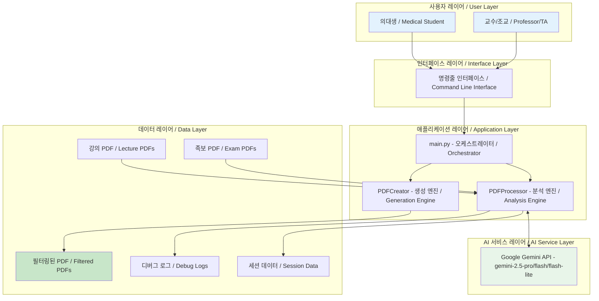

### 전체 구조도 / Overall Architecture Diagram

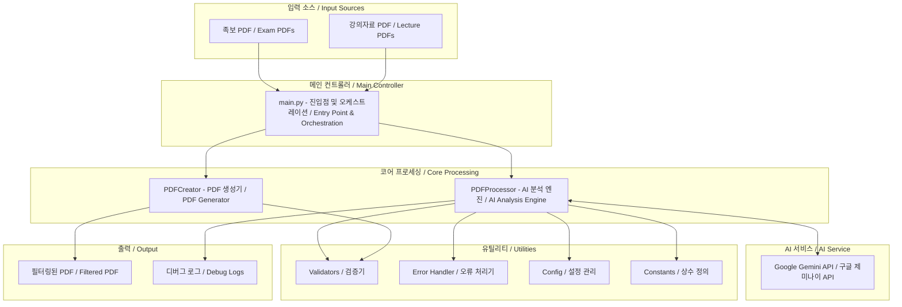

### 상세 컴포넌트 다이어그램 / Detailed Component Diagram

```mermaid
graph TB
    subgraph "Core Processing Pipeline"
        direction TB
        
        subgraph "Entry Point"
            MAIN[main.py | 명령줄 파싱, 모드 라우팅, 세션 관리]
        end
        
        subgraph "Processing Modes"
            LC[강의 중심 모드 Lesson-Centric | 강의별 분석, 관련 문제 추출]
            JC[족보 중심 모드 Jokbo-Centric | 문제별 분석, 관련 슬라이드 매칭]
        end
        
        subgraph "Core Engines"
            PROC[PDFProcessor | 파일 업로드, AI 분석, 청킹 처리, 결과 병합]
            CREA[PDFCreator | 페이지 추출, 설명 생성, PDF 병합, 캐시 관리]
        end
        
        subgraph "Support Modules"
            VAL[Validators | 페이지 검증, 범위 조정]
            HELP[Helpers | JSON 파싱, 결과 병합]
            ERR[ErrorHandler | 예외 처리, 로깅]
            CONST[Constants | 프롬프트, 설정값]
        end
    end
    
    subgraph "External Services"
        GEM[Gemini API | 파일 저장소, AI 모델, JSON 응답]
    end
    
    subgraph "Data Storage"
        CACHE[PDF 캐시 | 스레드 안전, 메모리 효율]
        SESS[세션 저장소 | 청크 결과, 처리 상태]
        DEBUG[디버그 로그 | API 응답, 오류 추적]
    end
    
    MAIN --> LC
    MAIN --> JC
    LC --> PROC
    JC --> PROC
    PROC --> VAL
    PROC --> HELP
    PROC --> ERR
    PROC --> CONST
    PROC <--> GEM
    PROC --> CREA
    PROC --> SESS
    PROC --> DEBUG
    CREA --> CACHE
    
    style MAIN fill:#fff8e1
    style PROC fill:#fce4ec
    style CREA fill:#fce4ec
    style GEM fill:#e8f5e9
```

### 기존 시스템 개요도 / Legacy System Overview

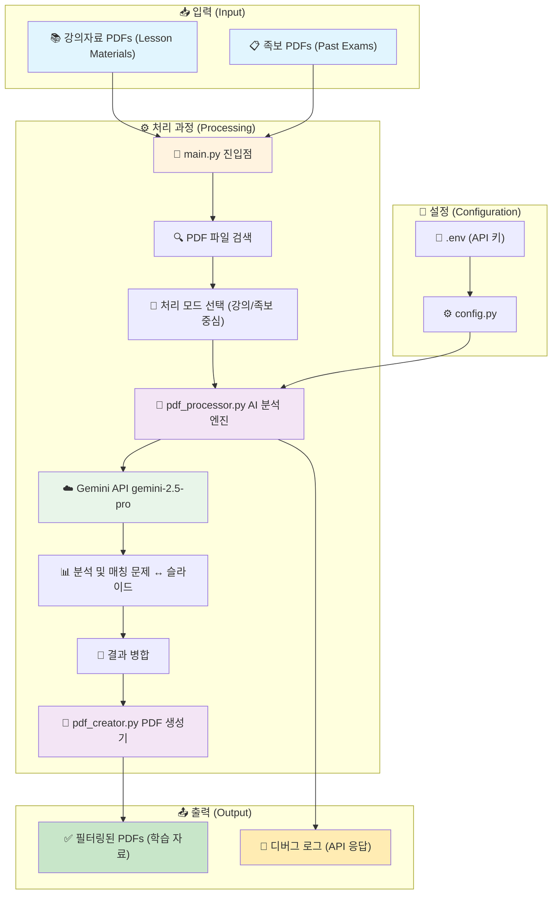

### 데이터 흐름도 / Data Flow Diagram

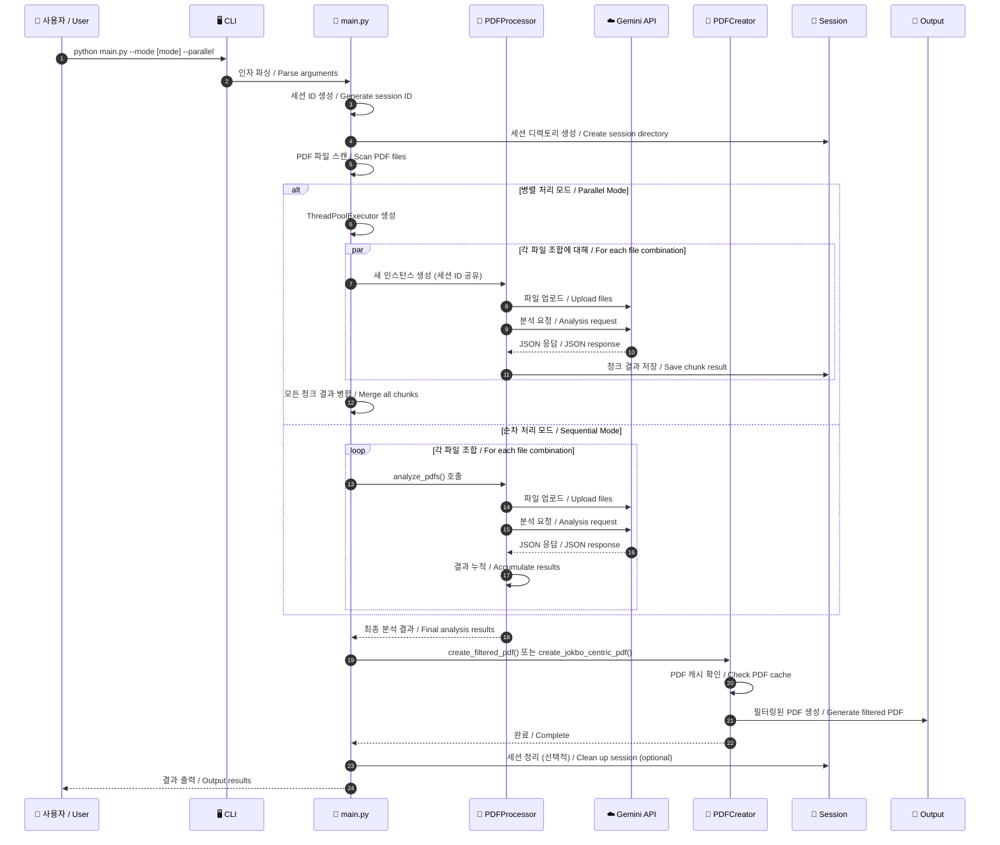

## 처리 모드별 상세 흐름 / Detailed Flow by Processing Mode

### 강의 중심 모드 흐름도 / Lesson-Centric Mode Flow

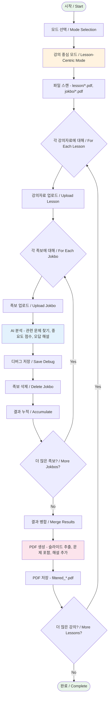

### 족보 중심 모드 흐름도 / Jokbo-Centric Mode Flow

```mermaid
flowchart TD
    Start([시작 / Start]) --> SelectMode[모드 선택 / Mode Selection]
    SelectMode --> JokboMode[족보 중심 모드 / Jokbo-Centric Mode]
    
    JokboMode --> ScanFiles[파일 스캔 - jokbo/*.pdf, lesson/*.pdf]
    
    ScanFiles --> ForEachJokbo{각 족보에 대해 / For Each Jokbo}
    
    ForEachJokbo --> CheckChunks{큰 파일? / Large File?}
    CheckChunks -->|Yes| SplitChunks[청크 분할 - Split into Chunks (40 pages)]
    CheckChunks -->|No| UploadJokbo[족보 업로드 / Upload Jokbo]
    
    SplitChunks --> ForEachChunk{각 청크에 대해 / For Each Chunk}
    ForEachChunk --> UploadJokbo
    
    UploadJokbo --> ForEachLesson{각 강의자료에 대해 / For Each Lesson}
    
    ForEachLesson --> UploadLesson[강의자료 업로드 / Upload Lesson]
    UploadLesson --> AnalyzeAI[AI 분석 - 관련 슬라이드, 관련성 점수, 상위 2개 선택]
    
    AnalyzeAI --> ScoreFilter{점수 >= 50? / Score >= 50?}
    ScoreFilter -->|Yes| SaveDebug[디버그 저장 / Save Debug]
    ScoreFilter -->|No| SkipQuestion[문제 제외 / Skip Question]
    
    SaveDebug --> DeleteLesson[강의자료 삭제 / Delete Lesson]
    DeleteLesson --> AccumulateResults[결과 누적 / Accumulate]
    SkipQuestion --> DeleteLesson
    
    AccumulateResults --> MoreLessons{더 많은 강의? / More Lessons?}
    MoreLessons -->|Yes| ForEachLesson
    MoreLessons -->|No| ChunkComplete[청크 완료 / Chunk Complete]
    
    ChunkComplete --> MoreChunks{더 많은 청크? / More Chunks?}
    MoreChunks -->|Yes| ForEachChunk
    MoreChunks -->|No| MergeChunks[청크 병합 / Merge Chunks]
    
    MergeChunks --> CreatePDF[PDF 생성 - 문제 페이지, 관련 슬라이드, 점수 표시]
    
    CreatePDF --> SavePDF[PDF 저장 - jokbo_centric_*.pdf]
    SavePDF --> MoreJokbos{더 많은 족보? / More Jokbos?}
    
    MoreJokbos -->|Yes| ForEachJokbo
    MoreJokbos -->|No| End([완료 / Complete])
    
    style Start fill:#e8f5e9
    style End fill:#e8f5e9
    style JokboMode fill:#fff3e0
    style AnalyzeAI fill:#e3f2fd
    style ScoreFilter fill:#ffebee
    style CreatePDF fill:#fce4ec
```

## 핵심 컴포넌트 / Core Components

### 1. main.py - 메인 엔트리 포인트 / Main Entry Point

**한국어**
- **역할**: 전체 프로그램의 진입점 및 워크플로우 오케스트레이션
- **주요 기능**:
  - 명령줄 인자 파싱 (argparse 사용)
  - 처리 모드 선택 (강의 중심 vs 족보 중심)
  - PDF 파일 검색 및 필터링 (Zone.Identifier 파일 제외)
  - 병렬/순차 처리 라우팅
  - 세션 관리 기능 (임시 파일 정리)
  - 진행 상황 모니터링

**English**
- **Role**: Program entry point and workflow orchestration
- **Key Functions**:
  - Command-line argument parsing (using argparse)
  - Processing mode selection (lesson-centric vs jokbo-centric)
  - PDF file discovery and filtering (excluding Zone.Identifier files)
  - Parallel/sequential processing routing
  - Session management (temporary file cleanup)
  - Progress monitoring

### 2. PDFProcessor - AI 분석 엔진 / AI Analysis Engine

**한국어**
- **역할**: Gemini API와의 통신 및 AI 기반 콘텐츠 분석
- **주요 기능**:
  - 파일 업로드/삭제 관리
  - 대용량 PDF 청킹 (40페이지 단위 분할)
  - 병렬 처리 지원 (ThreadPoolExecutor 사용)
  - 지수 백오프 재시도 로직
  - JSON 응답 파싱 및 부분 복구
  - 세션 기반 실행 격리
  - 스레드 안전 PDF 캐싱

**English**
- **Role**: Communication with Gemini API and AI-based content analysis
- **Key Functions**:
  - File upload/deletion management
  - Large PDF chunking (40-page units)
  - Parallel processing support (using ThreadPoolExecutor)
  - Exponential backoff retry logic
  - JSON response parsing and partial recovery
  - Session-based execution isolation
  - Thread-safe PDF caching

### 3. PDFCreator - PDF 생성기 / PDF Generator

**한국어**
- **역할**: 분석 결과를 기반으로 필터링된 PDF 생성
- **주요 기능**:
  - 다중 페이지 문제 추출
  - CJK 폰트를 사용한 한글 텍스트 렌더링
  - 설명 페이지 자동 생성
  - 스레드 안전 PDF 캐싱
  - 문제 번호순 정렬

**English**
- **Role**: Generate filtered PDFs based on analysis results
- **Key Functions**:
  - Multi-page question extraction
  - Korean text rendering using CJK fonts
  - Automatic explanation page generation
  - Thread-safe PDF caching
  - Question number-based sorting

## 병렬 처리 아키텍처 / Parallel Processing Architecture

### 병렬 처리 흐름도 / Parallel Processing Flow

```mermaid
graph TB
    subgraph "메인 프로세스 / Main Process"
        M1[main.py]
        M2[메인 PDFProcessor | 세션 ID: 20250801_123456_abc123]
        M3[ThreadPoolExecutor | max_workers=3]
    end
    
    subgraph "워커 스레드 풀 / Worker Thread Pool"
        subgraph "Thread 1"
            T1[PDFProcessor - 동일 세션 ID 사용]
            T1F1[족보1 처리 / Process Jokbo1]
            T1R[chunk_001.json]
        end
        
        subgraph "Thread 2"
            T2[PDFProcessor - 동일 세션 ID 사용]
            T2F1[족보2 처리 / Process Jokbo2]
            T2R[chunk_002.json]
        end
        
        subgraph "Thread 3"
            T3[PDFProcessor - 동일 세션 ID 사용]
            T3F1[족보3 처리 / Process Jokbo3]
            T3R[chunk_003.json]
        end
    end
    
    subgraph "공유 리소스 / Shared Resources"
        SESS[세션 디렉토리 - output/temp/sessions/20250801_123456_abc123/]
        CHUNK[chunk_results/]
        CACHE[PDF 캐시 - threading.Lock 보호]
        PROGRESS[tqdm 진행률 / Progress Bar]
    end
    
    subgraph "결과 병합 / Result Merging"
        MERGE[결과 병합기 / Result Merger]
        FINAL[최종 분석 결과 / Final Analysis]
    end
    
    M1 --> M2
    M2 --> M3
    M3 --> T1
    M3 --> T2
    M3 --> T3
    
    T1 --> T1F1
    T2 --> T2F1
    T3 --> T3F1
    
    T1F1 --> T1R
    T2F1 --> T2R
    T3F1 --> T3R
    
    T1R --> CHUNK
    T2R --> CHUNK
    T3R --> CHUNK
    
    T1 -.-> SESS
    T2 -.-> SESS
    T3 -.-> SESS
    
    T1 -.-> CACHE
    T2 -.-> CACHE
    T3 -.-> CACHE
    
    T1 -.-> PROGRESS
    T2 -.-> PROGRESS
    T3 -.-> PROGRESS
    
    CHUNK --> MERGE
    MERGE --> FINAL
    
    style M1 fill:#fff8e1
    style T1 fill:#e3f2fd
    style T2 fill:#e3f2fd
    style T3 fill:#e3f2fd
    style CACHE fill:#ffebee
    style FINAL fill:#c8e6c9
```

### 스레드 안전성 메커니즘 / Thread Safety Mechanisms

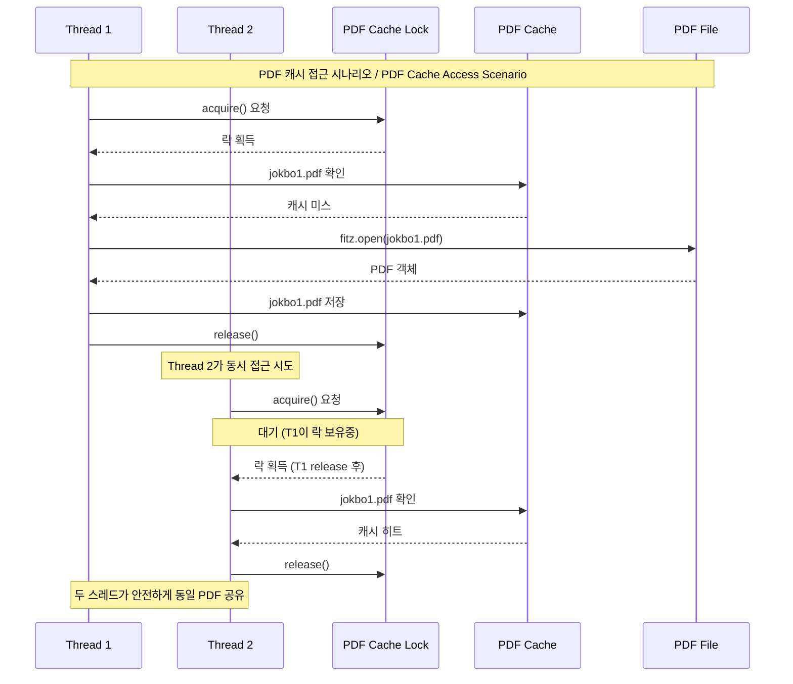

## 상세 데이터 흐름 (Detailed Data Flow)

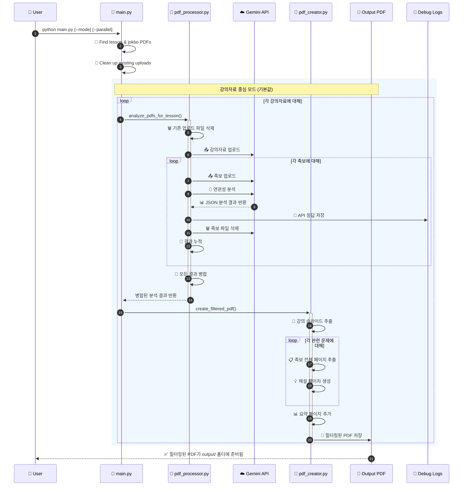

## 청킹 전략 및 대용량 파일 처리 / Chunking Strategy and Large File Processing

### 청킹 프로세스 / Chunking Process

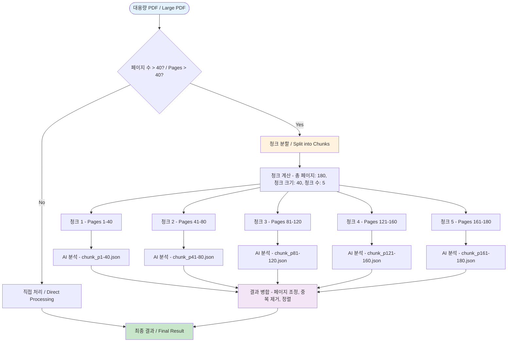

### 청크 결과 병합 로직 / Chunk Result Merging Logic

```mermaid
graph LR
    subgraph "청크 결과 파일 / Chunk Result Files"
        C1[chunk_p1-40.json | 문제 1-15, 페이지 조정 필요]
        C2[chunk_p41-80.json | 문제 16-30, 페이지 조정 필요]
        C3[chunk_p81-120.json | 문제 31-45, 페이지 조정 필요]
    end
    
    subgraph "병합 프로세스 / Merging Process"
        LOAD[파일 로드 / Load Files]
        ADJUST[페이지 조정 - chunk_start + page - 1]
        VALIDATE[검증 - 범위 확인, 중복 체크]
        COMBINE[결합 - 정렬, 병합]
    end
    
    subgraph "최종 결과 / Final Result"
        FINAL[통합 결과 - 모든 문제, 올바른 페이지, 정렬됨]
    end
    
    C1 --> LOAD
    C2 --> LOAD
    C3 --> LOAD
    LOAD --> ADJUST
    ADJUST --> VALIDATE
    VALIDATE --> COMBINE
    COMBINE --> FINAL
    
    style C1 fill:#e3f2fd
    style C2 fill:#e3f2fd
    style C3 fill:#e3f2fd
    style FINAL fill:#c8e6c9
```

## 컴포넌트 구조 (Component Architecture)

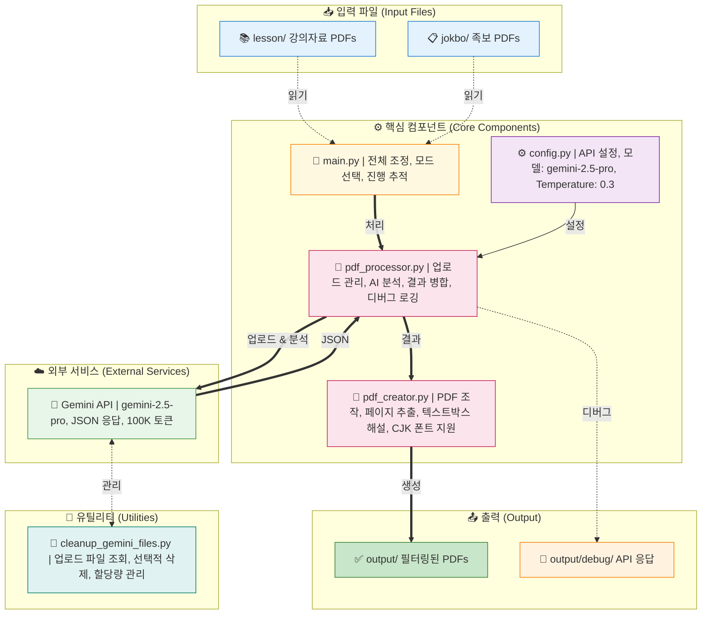

## 세션 관리 시스템 / Session Management System

### 세션 생명주기 / Session Lifecycle

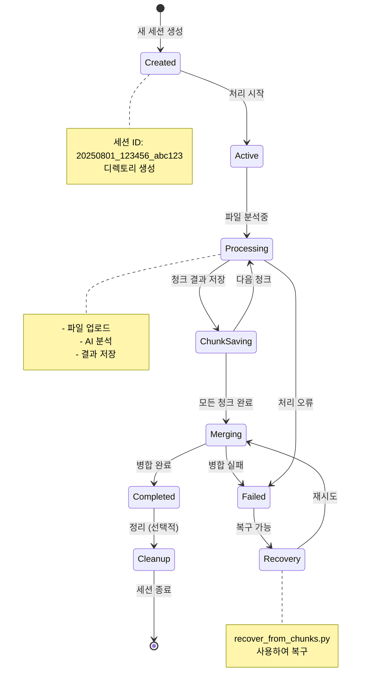

### 세션 디렉토리 구조 / Session Directory Structure

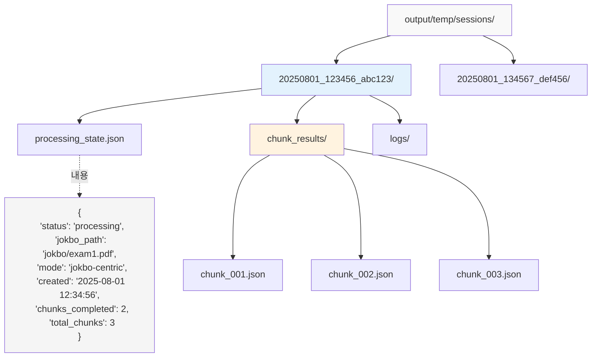

## PDF 생성 프로세스 (PDF Creation Process)

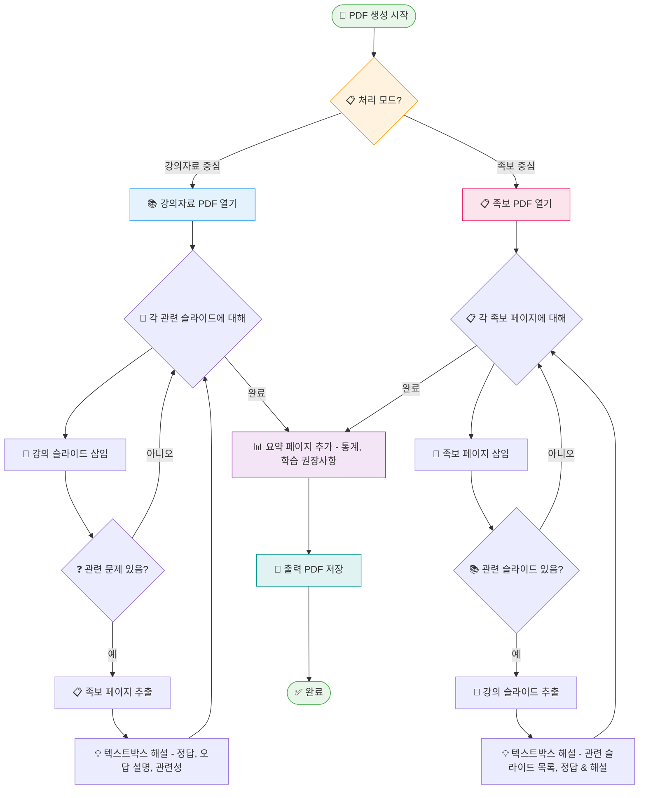

## API 상호작용 패턴 / API Interaction Patterns

### Gemini API 통신 흐름 / Gemini API Communication Flow

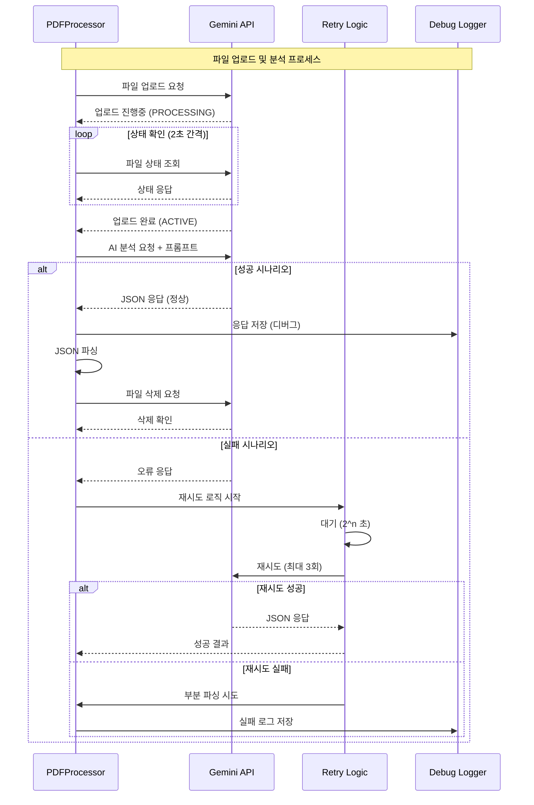

### API 사용 최적화 전략 / API Usage Optimization Strategy


## Gemini API 설정 (Configuration)

### 모델 설정 (Model Settings)

```python
GENERATION_CONFIG = {
    "temperature": 0.3,          # Low temperature for consistent results
    "top_p": 0.95,              # Nucleus sampling parameter
    "top_k": 40,                # Top-k sampling parameter
    "max_output_tokens": 100000, # Maximum output tokens (very high)
    "response_mime_type": "application/json"  # Force JSON response
}

# Available Models:
- gemini-2.5-pro (default) - Highest quality
- gemini-2.5-flash - Faster, cheaper
- gemini-2.5-flash-lite - Fastest, cheapest

# Thinking Budget (Flash/Flash-lite only):
- 0: Disable thinking (fastest)
- 1-24576: Manual budget
- -1: Automatic (model decides)
```

### 안전 설정 (Safety Settings)

모든 안전 카테고리를 `BLOCK_NONE`으로 설정하여 콘텐츠 차단 방지:
- HARM_CATEGORY_HARASSMENT
- HARM_CATEGORY_HATE_SPEECH
- HARM_CATEGORY_SEXUALLY_EXPLICIT
- HARM_CATEGORY_DANGEROUS_CONTENT

### API 사용 패턴 (Usage Pattern)

1. **Upload Pattern**: One lesson PDF + One jokbo PDF at a time
2. **Request Frequency**: Sequential processing (one jokbo at a time)
3. **File Management**: 
   - Clean up all existing uploads before starting
   - Upload files as needed
   - Delete immediately after analysis
   - Retry logic for failed deletions
4. **Error Handling**: Retry logic for file processing states
5. **Debug Support**: All API responses saved to output/debug/ for troubleshooting

### 토큰 제한 및 제약사항 (Token Limits)

- **Max Output Tokens**: 100,000 tokens (configured)
- **Input Size**: Limited by PDF file upload size
- **Processing Time**: 2-second polling interval for file upload status
- **Concurrent Uploads**: Not used - sequential processing only

### 응답 형식 (Response Format)

#### 강의자료 중심 모드 응답 (Lesson-Centric)
```json
{
  "related_slides": [{
    "lesson_page": number,
    "related_jokbo_questions": [{
      "jokbo_filename": string,
      "jokbo_page": number,
      "jokbo_end_page": number,  // For multi-page questions
      "question_number": number,
      "question_text": string,
      "answer": string,
      "explanation": string,
      "wrong_answer_explanations": {
        "1번": "Why option 1 is wrong",
        "2번": "Why option 2 is wrong",
        "3번": "Why option 3 is wrong",
        "4번": "Why option 4 is wrong"
      },
      "relevance_reason": string
    }],
    "importance_score": 1-10,
    "key_concepts": [string]
  }],
  "summary": {
    "total_related_slides": number,
    "total_questions": number,
    "key_topics": [string],
    "study_recommendations": string
  }
}
```

#### 족보 중심 모드 응답 (Jokbo-Centric)
```json
{
  "jokbo_pages": [{
    "jokbo_page": number,
    "questions": [{
      "question_number": number,
      "question_text": string,
      "answer": string,
      "explanation": string,
      "wrong_answer_explanations": {
        "1번": "...",
        "2번": "...",
        "3번": "...",
        "4번": "..."
      },
      "related_lesson_slides": [{
        "lesson_filename": string,
        "lesson_page": number,
        "relevance_reason": string
      }]
    }]
  }],
  "summary": {
    "total_jokbo_pages": number,
    "total_questions": number,
    "total_related_slides": number,
    "study_recommendations": string
  }
}
```

## 관련성 점수 시스템 상세 / Relevance Scoring System Details

### 점수 계산 프로세스 / Score Calculation Process

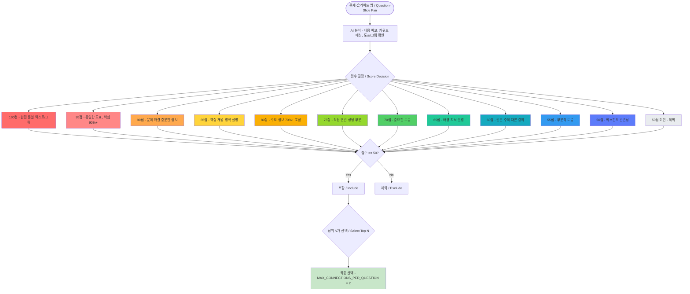

### 점수별 실제 예시 / Real Examples by Score

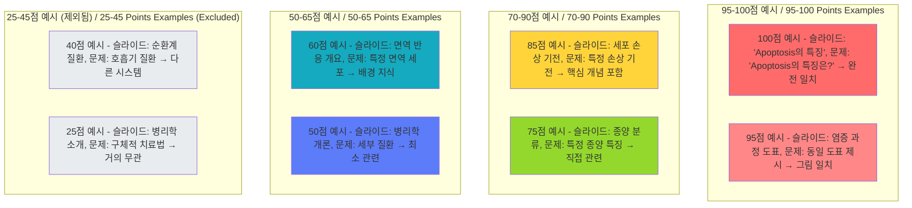

## 처리 모드 / Processing Modes

### 강의 중심 모드 / Lesson-Centric Mode

```mermaid
graph LR
    A[강의자료 / Lecture Material] --> B[분석 / Analysis]
    C[모든 족보 / All Jokbos] --> B
    B --> D[관련 문제 그룹화 / Group Related Questions]
    D --> E[필터링된 PDF / Filtered PDF]
    
    style A fill:#f9f,stroke:#333,stroke-width:4px
    style C fill:#bbf,stroke:#333,stroke-width:2px
```

**한국어**
- **목적**: 특정 강의 주제 학습에 최적화
- **프로세스**: 각 강의자료를 기준으로 모든 족보와 비교
- **출력**: 강의 슬라이드 → 관련 시험 문제 → AI 해설
- **사용 시나리오**: 수업 내용 복습, 특정 주제 심화 학습

**English**
- **Purpose**: Optimized for studying specific lecture topics
- **Process**: Compare each lecture material against all jokbos
- **Output**: Lecture slide → Related exam questions → AI explanations
- **Use Cases**: Lecture review, deep dive into specific topics

### 족보 중심 모드 / Jokbo-Centric Mode

```mermaid
graph LR
    A[족보 / Jokbo] --> B[분석 / Analysis]
    C[모든 강의자료 / All Lectures] --> B
    B --> D[관련 슬라이드 매칭 / Match Related Slides]
    D --> E[점수 기반 필터링 / Score-based Filtering]
    E --> F[필터링된 PDF / Filtered PDF]
    
    style A fill:#f9f,stroke:#333,stroke-width:4px
    style C fill:#bbf,stroke:#333,stroke-width:2px
```

**한국어**
- **목적**: 시험 준비에 최적화
- **프로세스**: 각 족보를 기준으로 모든 강의자료와 비교
- **출력**: 시험 문제 → 관련 강의 슬라이드 → AI 해설
- **특징**:
  - 100점 만점 관련성 점수 시스템
  - 문제당 상위 2개 연결만 선택
  - 최소 50점 이상 연결만 포함

**English**
- **Purpose**: Optimized for exam preparation
- **Process**: Compare each jokbo against all lecture materials
- **Output**: Exam question → Related lecture slides → AI explanations
- **Features**:
  - 100-point relevance scoring system
  - Top 2 connections per question
  - Minimum 50-point threshold filtering

## 관련성 점수 체계 / Relevance Scoring System

```mermaid
graph TB
    subgraph "점수 체계 / Scoring System"
        A[90-100점 - 핵심 출제] 
        B[70-85점 - 직접 관련]
        C[50-65점 - 중간 관련]
        D[25-45점 - 간접 관련]
        E[5-20점 - 거의 무관]
    end
    
    A --> F[95점: 동일한 그림/도표 ⭐]
    A --> G[90점: 100% 정답 가능 🎯]
    
    style A fill:#f96,stroke:#333,stroke-width:2px
    style B fill:#fa6,stroke:#333,stroke-width:2px
    style C fill:#ff6,stroke:#333,stroke-width:2px
    style D fill:#ffc,stroke:#333,stroke-width:2px
    style E fill:#fff,stroke:#333,stroke-width:2px
```

## 디버깅 및 모니터링 / Debugging and Monitoring

### 디버그 시스템 구조 / Debug System Architecture

```mermaid
graph TB
    subgraph "디버그 데이터 수집 / Debug Data Collection"
        API[API 응답 - 원본 JSON, 타임스탬프, 파일 정보]
        ERROR[오류 정보 - 예외 스택, 컨텍스트, 재시도 횟수]
        PERF[성능 메트릭 - 처리 시간, 메모리 사용, API 호출수]
    end
    
    subgraph "저장 위치 / Storage Locations"
        DEBUG_DIR[output/debug/]
        DEBUG_DIR --> RESP[gemini_response_*.json]
        DEBUG_DIR --> FAIL[failed_json_*.txt]
        DEBUG_DIR --> LOG[pdf_creator_debug.log]
        
        SESSION_DIR[output/temp/sessions/*/]
        SESSION_DIR --> STATE[processing_state.json]
        SESSION_DIR --> CHUNK[chunk_results/*.json]
    end
    
    subgraph "모니터링 도구 / Monitoring Tools"
        TQDM[tqdm 진행률 - 실시간 진행, ETA 표시, 처리 속도]
        CONSOLE[콘솔 출력 - 세션 ID, 처리 상태, 오류 메시지]
        FILES[파일 모니터링 - 청크 생성, 결과 병합, 최종 출력]
    end
    
    API --> DEBUG_DIR
    ERROR --> DEBUG_DIR
    PERF --> SESSION_DIR
    
    style API fill:#e3f2fd
    style ERROR fill:#ffebee
    style PERF fill:#fff3e0
    style TQDM fill:#c8e6c9
```

### 디버그 파일 형식 / Debug File Formats

```mermaid
graph LR
    subgraph "API 응답 파일 / API Response File"
        JSON["gemini_response_20250801_133104_*.json | {
  'timestamp': '2025-08-01 13:31:04',
  'lesson_file': 'lesson1.pdf',
  'jokbo_file': 'exam1.pdf',
  'mode': 'jokbo-centric',
  'response_text': '...',
  'parsed_json': {...},
  'parse_success': true
}"]
    end
    
    subgraph "실패 JSON 파일 / Failed JSON File"
        FAIL["failed_json_chunk_p31-60.txt | 원본 응답 텍스트, 파싱 실패 원인, 부분 복구 시도 결과"]
    end
    
    subgraph "처리 상태 파일 / Processing State File"
        STATE["processing_state.json | {
  'status': 'processing',
  'mode': 'jokbo-centric',
  'jokbo_path': 'jokbo/exam1.pdf',
  'created': '2025-08-01 13:31:04',
  'chunks_completed': 3,
  'total_chunks': 5,
  'current_chunk': 'p121-160'
}"]
    end
    
    style JSON fill:#e3f2fd
    style FAIL fill:#ffebee
    style STATE fill:#fff3e0
```

## Operating Modes (작동 모드)

### 1. Lesson-Centric Mode (강의자료 중심 - 기본값)
- 각 강의자료를 기준으로 모든 족보와 비교
- 출력: `filtered_{강의자료명}_all_jokbos.pdf`
- 용도: 특정 강의의 중요 내용 파악

### 2. Jokbo-Centric Mode (족보 중심)
- 각 족보를 기준으로 모든 강의자료와 비교
- 출력: `jokbo_centric_{족보명}_all_lessons.pdf`
- 용도: 시험 직전 족보 위주 학습
- 구조: 족보 페이지 → 관련 강의 슬라이드들 → AI 해설

### 3. Parallel Processing (병렬 처리)
- ThreadPoolExecutor 사용 (기본 3 workers)
- Pre-upload 방식으로 공통 파일 재사용
- 각 스레드별 독립적인 PDFProcessor 인스턴스
- **개선된 안정성 (2025-07-28)**:
  - 스레드 안전 PDF 캐시 (threading.Lock)
  - API 호출 자동 재시도 (지수 백오프)
  - 진행률 표시 (tqdm 통합)
  - 리소스 자동 정리 (finally 블록)

## 주요 기능 (Key Features)

### 1. 스마트 파일 업로드 관리
- 처리 전 모든 업로드 파일 삭제
- 메모리 효율을 위한 순차적 업로드/삭제
- 실패 시 자동 재시도 로직

### 2. 디버그 지원
- 모든 Gemini API 응답을 `output/debug/`에 저장
- 타임스탬프, 파일명, 원본 응답, 파싱 상태 포함
- 문제 해결에 필수적

### 3. 프롬프트 엔지니어링
- 강의자료 내 문제 엄격 제외
- 정확한 페이지/문제 번호 강제
- 일관성을 위한 파일명 보존

### 4. 여러 페이지 문제 지원
- 여러 페이지에 걸친 문제 처리
- 적절한 추출을 위해 `jokbo_end_page` 필드 사용

### 5. 오답 해설 기능
- 각 선택지가 오답인 이유 상세 설명
- 학생들의 일반적인 실수 이해 도움

## Recent Updates (최근 업데이트)

### 2025-07-28
1. **병렬 처리 모드 대규모 개선**
   - 족보 중심 병렬 모드의 `all_connections` 미정의 버그 수정
   - PDF 캐시에 스레드 안전성 추가 (threading.Lock)
   - API 호출 실패 시 자동 재시도 로직 구현
   - tqdm을 통한 실시간 진행률 표시
   - 스레드별 리소스 정리로 메모리 누수 방지
   - 중심 파일 삭제 조정으로 경쟁 상태 해결

2. **PDF 객체 일관성 버그 수정**
   - `create_jokbo_centric_pdf`에서 캐시된 PDF 메커니즘 사용
   - 페이지 경계 문제 해결 (마지막 문제의 다음 페이지 포함)
   - 디버그 로깅 추가로 페이지 포함 로직 추적 가능

3. **문서 개선**
   - README.md 사용법을 표 형식으로 재구성
   - 시나리오별 최적 설정 추가
   - 명령어 옵션 가독성 향상
   - 병렬 모드 개선사항 문서화

### 2025-07-27
1. **Gemini 모델 선택 기능**
   - Pro, Flash, Flash-lite 모델 지원
   - Thinking Budget 설정 옵션 추가
   - 비용/속도 최적화 가능

2. **PyMuPDF Story API 오류 수정**
   - Story.draw() 메서드 TypeError 해결
   - Story 클래스 대신 insert_textbox() 사용
   - PyMuPDF 버전 호환성 문제 해결
   - CJK 폰트로 한글 텍스트 렌더링 개선

### 2025-07-26
1. **파일 업로드 관리 개선**
   - 자동 클린업 기능 추가
   - 메모리 효율성 향상
   
2. **디버깅 기능 강화**
   - API 응답 자동 저장
   - JSON 파싱 검증
   
3. **프롬프트 개선**
   - 강의자료 내 문제 제외 명시
   - 문제 번호 정확성 강화

## Data Flow Comparison (데이터 흐름 비교)

### Lesson-Centric Flow
```
1. For each lesson PDF:
   a. Clean up existing uploads
   b. Upload lesson file
   c. For each jokbo:
      - Upload jokbo
      - Analyze relationship
      - Save debug log
      - Delete jokbo
   d. Merge results
   e. Generate filtered PDF
```

### Jokbo-Centric Flow
```
1. For each jokbo PDF:
   a. Clean up existing uploads
   b. Upload jokbo file
   c. For each lesson:
      - Upload lesson
      - Analyze relationship
      - Save debug log
      - Delete lesson
   d. Merge results
   e. Generate jokbo-centric PDF
```

## 오류 처리 및 복구 메커니즘 / Error Handling and Recovery Mechanisms

### 오류 처리 계층 구조 / Error Handling Hierarchy

```mermaid
graph TB
    subgraph "오류 유형 / Error Types"
        E1[파일 오류 - 파일 없음, 권한 문제, 손상된 PDF]
        E2[API 오류 - 네트워크, 할당량 초과, 타임아웃]
        E3[파싱 오류 - JSON 형식, 필드 누락, 타입 불일치]
        E4[처리 오류 - 메모리 부족, 청크 실패, 병합 오류]
    end
    
    subgraph "처리 전략 / Handling Strategies"
        H1[즉시 재시도 - 네트워크 오류, 일시적 실패]
        H2[지수 백오프 - API 제한, 서버 과부하]
        H3[부분 복구 - JSON 파싱, 청크 복구]
        H4[대체 처리 - 기본값 사용, 건너뛰기]
    end
    
    subgraph "복구 도구 / Recovery Tools"
        R1[recover_from_chunks.py - 중단된 작업 재개]
        R2[cleanup_sessions.py - 오류 세션 정리]
        R3[수동 복구 - 디버그 로그 분석]
    end
    
    E1 --> H4
    E2 --> H1
    E2 --> H2
    E3 --> H3
    E4 --> H3
    
    H1 --> R3
    H2 --> R3
    H3 --> R1
    H4 --> R2
    
    style E1 fill:#ffebee
    style E2 fill:#ffebee
    style E3 fill:#ffebee
    style E4 fill:#ffebee
    style R1 fill:#c8e6c9
    style R2 fill:#c8e6c9
```

### 재시도 로직 상세 / Retry Logic Details

```mermaid
sequenceDiagram
    participant F as Function
    participant R as Retry Logic
    participant A as API/Operation
    participant L as Logger
    
    F->>R: 작업 실행 요청
    
    loop 최대 3회 재시도
        R->>A: 작업 시도
        alt 성공
            A-->>R: 성공 응답
            R-->>F: 결과 반환
        else 실패
            A-->>R: 오류 발생
            R->>L: 오류 로깅
            R->>R: 대기 시간 계산 - wait = 2^attempt 초
            Note over R: 1차: 2초, 2차: 4초, 3차: 8초
            R->>R: 대기
        end
    end
    
    R->>L: 최종 실패 로깅
    R->>F: 부분 복구 시도
    
    alt 부분 복구 가능
        R-->>F: 부분 결과
    else 복구 불가
        R-->>F: 오류 반환
    end
```

## 유틸리티 도구 / Utility Tools

### cleanup_gemini_files.py - API 파일 관리 / API File Management

**한국어**
- **목적**: Gemini API에 업로드된 파일 관리
- **기능**:
  - 업로드된 모든 파일 목록 조회
  - 파일별 상세 정보 표시 (크기, 상태, 생성시간)
  - 선택적 삭제 또는 전체 삭제
  - 대화형 인터페이스
- **사용 시나리오**:
  - 프로그램 오류로 인한 잔여 파일 정리
  - API 할당량 관리
  - 디버깅 후 클린업

**English**
- **Purpose**: Manage files uploaded to Gemini API
- **Features**:
  - List all uploaded files
  - Display detailed file information (size, status, creation time)
  - Selective or bulk deletion
  - Interactive interface
- **Use Cases**:
  - Clean up residual files from program errors
  - API quota management
  - Post-debugging cleanup

### cleanup_sessions.py - 세션 관리 / Session Management

**한국어**
- **목적**: 임시 세션 파일 관리 및 정리
- **기능**:
  - 세션 목록 표시 (크기, 생성일, 상태)
  - 오래된 세션 자동 정리
  - 선택적 또는 일괄 삭제
- **명령어**:
  ```bash
  python cleanup_sessions.py           # 대화형 모드
  python main.py --list-sessions      # 세션 목록
  python main.py --cleanup-old 7      # 7일 이상 된 세션 삭제
  ```

**English**
- **Purpose**: Manage and clean up temporary session files
- **Features**:
  - Display session list (size, creation date, status)
  - Automatic cleanup of old sessions
  - Selective or bulk deletion
- **Commands**:
  ```bash
  python cleanup_sessions.py           # Interactive mode
  python main.py --list-sessions      # List sessions
  python main.py --cleanup-old 7      # Delete sessions older than 7 days
  ```

### recover_from_chunks.py - 중단된 작업 복구 / Interrupted Work Recovery

**한국어**
- **목적**: 중단된 PDF 생성 작업 복구
- **기능**:
  - 청크 파일에서 결과 복구
  - 세션별 복구 지원
  - 중단 지점부터 재시작
- **명령어**:
  ```bash
  python recover_from_chunks.py --list-sessions    # 복구 가능한 세션 목록
  python recover_from_chunks.py --session SESSION_ID  # 특정 세션 복구
  ```

**English**
- **Purpose**: Recover interrupted PDF generation tasks
- **Features**:
  - Recover results from chunk files
  - Session-aware recovery support
  - Resume from interruption point
- **Commands**:
  ```bash
  python recover_from_chunks.py --list-sessions    # List recoverable sessions
  python recover_from_chunks.py --session SESSION_ID  # Recover specific session
  ```

## 성능 최적화 전략 / Performance Optimization Strategies

### 최적화 기법 비교 / Optimization Techniques Comparison

```mermaid
graph TB
    subgraph "처리 모드별 성능 / Performance by Mode"
        SEQ[순차 처리 - 안정적, 느림, 메모리 효율적]
        PAR[병렬 처리 - 3배 빠름, 메모리 사용↑, CPU 활용↑]
    end
    
    subgraph "모델별 성능 / Performance by Model"
        PRO[Gemini Pro - 최고 품질, 느림, 비용 높음]
        FLASH[Gemini Flash - 균형, 중간 속도, 중간 비용]
        LITE[Gemini Flash-lite - 최고 속도, 품질 낮음, 비용 낮음]
    end
    
    subgraph "최적화 기법 / Optimization Techniques"
        CACHE[PDF 캐싱 - I/O 감소, 메모리 트레이드오프]
        CHUNK[청킹 - 대용량 처리, 부분 실패 복구]
        POOL[스레드 풀 - CPU 활용, 동시성 제어]
    end
    
    SEQ -.-> CACHE
    PAR -.-> POOL
    PAR -.-> CACHE
    PRO -.-> CHUNK
    FLASH -.-> CHUNK
    LITE -.-> CHUNK
    
    style PAR fill:#c8e6c9
    style FLASH fill:#fff3e0
    style CACHE fill:#e3f2fd
```

### 성능 메트릭 예시 / Performance Metrics Example

```mermaid
graph LR
    subgraph "테스트 환경 / Test Environment"
        TEST["설정 - 족보: 5개 (각 20페이지), 강의: 10개 (각 50페이지), 총 분석: 50개 조합"]
    end
    
    subgraph "순차 처리 / Sequential"
        S_TIME[처리 시간 - 45분]
        S_MEM[메모리 - ~500MB]
        S_CPU[CPU - 25%]
    end
    
    subgraph "병렬 처리 (3 workers) / Parallel"
        P_TIME[처리 시간 - 15분]
        P_MEM[메모리 - ~1.5GB]
        P_CPU[CPU - 75%]
    end
    
    subgraph "최적화 결과 / Optimization Results"
        RESULT["개선 효과 - 시간: 67% 감소, 처리량: 3배 증가, 효율성: 크게 향상"]
    end
    
    TEST --> S_TIME
    TEST --> S_MEM
    TEST --> S_CPU
    
    TEST --> P_TIME
    TEST --> P_MEM
    TEST --> P_CPU
    
    S_TIME --> RESULT
    P_TIME --> RESULT
    
    style P_TIME fill:#c8e6c9
    style RESULT fill:#e8f5e9
```

## 성능 최적화 / Performance Optimizations

### 병렬 처리 최적화 상세 / Parallel Processing Optimization Details

```mermaid
flowchart TD
    Start([병렬 처리 시작]) --> CheckMode{처리 모드?}
    
    CheckMode -->|강의 중심| LC_Pre[강의 파일 사전 업로드 / Pre-upload Lesson]
    CheckMode -->|족보 중심| JC_Pre[족보 파일 사전 업로드 / Pre-upload Jokbo]
    
    LC_Pre --> CreatePool1[ThreadPoolExecutor 생성 - max_workers=3]
    JC_Pre --> CreatePool2[ThreadPoolExecutor 생성 - max_workers=3]
    
    CreatePool1 --> LC_Distribute[작업 분배 - 각 족보를 스레드에 할당]
    CreatePool2 --> JC_Distribute[작업 분배 - 각 강의를 스레드에 할당]
    
    LC_Distribute --> LC_Process[병렬 처리 - 공유 세션 ID, 독립 분석, 청크 저장]
    JC_Distribute --> JC_Process[병렬 처리 - 공유 세션 ID, 독립 분석, 청크 저장]
    
    LC_Process --> Progress1[진행률 표시 - tqdm 업데이트]
    JC_Process --> Progress2[진행률 표시 - tqdm 업데이트]
    
    Progress1 --> Collect1[결과 수집 - as_completed()]
    Progress2 --> Collect2[결과 수집 - as_completed()]
    
    Collect1 --> Merge[결과 병합 - 청크 로드, 페이지 조정, 중복 제거]
    Collect2 --> Merge
    
    Merge --> Cleanup[정리 작업 - 파일 삭제, 캐시 정리, 세션 마감]
    
    Cleanup --> End([완료])
    
    style Start fill:#e8f5e9
    style LC_Pre fill:#e3f2fd
    style JC_Pre fill:#e3f2fd
    style Progress1 fill:#c8e6c9
    style Progress2 fill:#c8e6c9
    style Merge fill:#f3e5f5
    style End fill:#e8f5e9
```

**한국어**
- **단일 세션 사용**: 모든 스레드가 동일한 세션 ID 공유
- **파일 기반 중간 저장**: 메모리 사용량 최소화
- **청크 단위 처리**: 대용량 파일을 40페이지 단위로 분할
- **캐싱 메커니즘**: PDF 객체 재사용으로 I/O 감소
- **진행률 표시**: tqdm을 통한 실시간 진행 상황 모니터링

**English**
- **Single Session Usage**: All threads share the same session ID
- **File-based Intermediate Storage**: Minimize memory usage
- **Chunk-based Processing**: Split large files into 40-page units
- **Caching Mechanism**: Reduce I/O through PDF object reuse
- **Progress Display**: Real-time progress monitoring via tqdm

## 보안 및 안전성 고려사항 / Security and Safety Considerations

### 보안 메커니즘 / Security Mechanisms

```mermaid
graph TB
    subgraph "입력 검증 / Input Validation"
        IV1[파일 검증 - PDF 형식 확인, 크기 제한, 경로 검증]
        IV2[명령 검증 - 인자 검증, 모드 확인, 범위 체크]
    end
    
    subgraph "API 보안 / API Security"
        AS1[API 키 관리 - 환경 변수, .env 파일, 노출 방지]
        AS2[안전 설정 - BLOCK_NONE, 콘텐츠 필터, 안전 카테고리]
    end
    
    subgraph "데이터 보호 / Data Protection"
        DP1[세션 격리 - 고유 세션 ID, 독립 디렉토리, 접근 제어]
        DP2[파일 정리 - 자동 삭제, 임시 파일, 업로드 정리]
    end
    
    subgraph "오류 안전성 / Error Safety"
        ES1[예외 처리 - 전역 핸들러, 컨텍스트 보존, 복구 가능]
        ES2[리소스 관리 - 자동 정리, 메모리 해제, 락 해제]
    end
    
    IV1 --> AS1
    IV2 --> AS1
    AS1 --> DP1
    AS2 --> DP1
    DP1 --> ES1
    DP2 --> ES2
    
    style IV1 fill:#ffebee
    style AS1 fill:#e3f2fd
    style DP1 fill:#fff3e0
    style ES1 fill:#e8f5e9
```

## 디렉토리 구조 / Directory Structure

```
jokbodude/
├── jokbo/                    # 족보 PDF 파일 / Exam PDF files
├── lesson/                   # 강의자료 PDF 파일 / Lecture PDF files
├── output/                   # 출력 디렉토리 / Output directory
│   ├── debug/               # 디버그 로그 / Debug logs
│   └── temp/                # 임시 파일 / Temporary files
│       └── sessions/        # 세션별 디렉토리 / Session directories
├── main.py                  # 메인 진입점 / Main entry point
├── pdf_processor.py         # AI 분석 엔진 / AI analysis engine
├── pdf_creator.py           # PDF 생성기 / PDF generator
├── config.py               # 설정 관리 / Configuration
├── constants.py            # 상수 정의 / Constants
├── validators.py           # 검증 유틸리티 / Validation utilities
├── pdf_processor_helpers.py # 헬퍼 함수 / Helper functions
└── error_handler.py        # 오류 처리 / Error handling
```

## 확장성 및 유지보수성 / Scalability and Maintainability

### 시스템 확장 포인트 / System Extension Points

```mermaid
graph TB
    subgraph "현재 시스템 / Current System"
        CURR[JokboDude v2.0 - CLI 기반, 로컬 처리, 파일 시스템]
    end
    
    subgraph "확장 가능 영역 / Extensible Areas"
        EXT1[인터페이스 - Web UI, REST API, 모바일 앱]
        EXT2[처리 엔진 - 분산 처리, GPU 가속, 클라우드]
        EXT3[AI 모델 - 다중 모델, 커스텀 모델, 앙상블]
        EXT4[저장소 - 클라우드, 데이터베이스, 캐시 서버]
    end
    
    subgraph "모듈화 설계 / Modular Design"
        MOD1[플러그인 아키텍처]
        MOD2[의존성 주입]
        MOD3[인터페이스 추상화]
        MOD4[설정 외부화]
    end
    
    CURR --> EXT1
    CURR --> EXT2
    CURR --> EXT3
    CURR --> EXT4
    
    EXT1 --> MOD1
    EXT2 --> MOD2
    EXT3 --> MOD3
    EXT4 --> MOD4
    
    style CURR fill:#e3f2fd
    style EXT1 fill:#fff3e0
    style EXT2 fill:#fff3e0
    style EXT3 fill:#fff3e0
    style EXT4 fill:#fff3e0
    style MOD1 fill:#e8f5e9
```

### 유지보수 전략 / Maintenance Strategy

```mermaid
graph LR
    subgraph "코드 품질 / Code Quality"
        CQ1[명확한 구조 - 모듈 분리, 단일 책임, DRY 원칙]
        CQ2[문서화 - 코드 주석, API 문서, 아키텍처]
        CQ3[테스트 - 단위 테스트, 통합 테스트, 디버그 도구]
    end
    
    subgraph "버전 관리 / Version Control"
        VC1[Git 전략 - 기능 브랜치, 의미있는 커밋, 태그 관리]
        VC2[변경 이력 - CHANGELOG, 릴리스 노트, 마이그레이션]
    end
    
    subgraph "모니터링 / Monitoring"
        MON1[로그 관리 - 구조화 로그, 로그 레벨, 순환 정책]
        MON2[성능 추적 - 처리 시간, 리소스 사용, 오류율]
    end
    
    CQ1 --> VC1
    CQ2 --> VC2
    CQ3 --> MON1
    VC1 --> MON2
    
    style CQ1 fill:#e3f2fd
    style CQ2 fill:#e3f2fd
    style CQ3 fill:#e3f2fd
    style MON1 fill:#c8e6c9
    style MON2 fill:#c8e6c9
```

## 환경 설정 / Environment Setup

### 필수 환경 변수 / Required Environment Variables

```bash
GEMINI_API_KEY=your_api_key_here  # Google Gemini API 키 / API Key
MAX_PAGES_PER_CHUNK=40            # 청크당 최대 페이지 수 / Max pages per chunk
```

### 모델 선택 옵션 / Model Selection Options

```mermaid
graph LR
    A[Gemini 2.5 Pro] -->|최고 품질 / Best Quality| B[고비용 / High Cost]
    C[Gemini 2.5 Flash] -->|균형 / Balanced| D[중간 비용 / Medium Cost]
    E[Gemini 2.5 Flash-lite] -->|최고 속도 / Fastest| F[저비용 / Low Cost]
```

## API 상호작용 / API Interactions

### Gemini API 통신 흐름 / Gemini API Communication Flow

```mermaid
sequenceDiagram
    participant P as PDFProcessor
    participant G as Gemini API
    participant F as File Storage
    
    P->>G: 파일 업로드 / Upload File
    G->>F: 저장 / Store
    G->>P: 파일 ID / File ID
    
    P->>G: 분석 요청 + 프롬프트 / Analysis Request + Prompt
    G->>G: AI 처리 / AI Processing
    G->>P: JSON 응답 / JSON Response
    
    P->>G: 파일 삭제 / Delete File
    G->>F: 삭제 / Remove
    G->>P: 확인 / Confirm
```

## 주요 설계 결정 / Key Design Decisions

### 1. 청킹 전략 / Chunking Strategy

**한국어**
- **결정**: 40페이지 단위 분할 (환경 변수로 조정 가능)
- **이유**: Gemini API 제한 및 메모리 효율성 고려
- **영향**: 대용량 PDF 처리 가능, 부분 실패 시 재시도 용이

**English**
- **Decision**: 40-page unit splitting (configurable via environment variable)
- **Rationale**: Gemini API limits and memory efficiency
- **Impact**: Enable large PDF processing, easy retry on partial failures

### 2. 스레드 안전성 / Thread Safety

**한국어**
- **결정**: threading.Lock을 사용한 PDF 캐시 보호
- **이유**: 병렬 처리 시 동시 접근 문제 방지
- **구현**: PDFCreator의 get_jokbo_pdf 메서드에 락 적용

**English**
- **Decision**: PDF cache protection using threading.Lock
- **Rationale**: Prevent concurrent access issues during parallel processing
- **Implementation**: Lock applied to PDFCreator's get_jokbo_pdf method

### 3. 세션 관리 / Session Management

**한국어**
- **결정**: 타임스탬프 + 랜덤 문자열 기반 세션 ID
- **이유**: 처리 격리 및 디버깅 용이성
- **특징**: 병렬 처리 시 단일 세션 공유로 리소스 효율성 향상

**English**
- **Decision**: Session ID based on timestamp + random string
- **Rationale**: Processing isolation and debugging ease
- **Feature**: Resource efficiency through single session sharing in parallel processing

### 4. 오류 처리 전략 / Error Handling Strategy

```mermaid
graph TB
    A[API 호출 / API Call] --> B{성공? / Success?}
    B -->|Yes| C[결과 처리 / Process Result]
    B -->|No| D[재시도 대기 / Wait for Retry]
    D --> E{재시도 횟수? / Retry Count?}
    E -->|< 3| A
    E -->|>= 3| F[부분 파싱 시도 / Try Partial Parse]
    F --> G{복구 가능? / Recoverable?}
    G -->|Yes| H[부분 결과 사용 / Use Partial Result]
    G -->|No| I[오류 반환 / Return Error]
```

## 향후 고려사항 / Future Considerations

### 기술 로드맵 / Technical Roadmap

```mermaid
gantt
    title JokboDude 개발 로드맵 / Development Roadmap
    dateFormat  YYYY-MM-DD
    section 단기 목표 (3개월)
    Context Caching 구현          :a1, 2025-08-01, 30d
    비동기 처리 도입              :a2, after a1, 30d
    웹 UI 프로토타입              :a3, after a1, 45d
    
    section 중기 목표 (6개월)
    분산 처리 시스템              :b1, after a2, 60d
    다중 AI 모델 지원             :b2, after a2, 45d
    실시간 협업 기능              :b3, after a3, 60d
    
    section 장기 목표 (1년)
    클라우드 서비스화             :c1, after b1, 90d
    모바일 앱 개발                :c2, after b3, 90d
    AI 모델 커스터마이징          :c3, after b2, 120d
```

### 기능 확장 계획 / Feature Expansion Plans

**한국어**

#### 단기 (3개월)
1. **Context Caching**: Gemini API 비용 50% 절감 목표
2. **비동기 처리**: 동시 처리량 10배 증가
3. **웹 인터페이스**: 드래그 앤 드롭 파일 업로드

#### 중기 (6개월)
1. **분산 처리**: 여러 서버에서 동시 처리
2. **다중 모델**: GPT-4, Claude 등 추가 지원
3. **실시간 협업**: 여러 사용자 동시 작업

#### 장기 (1년)
1. **SaaS 전환**: 구독 기반 클라우드 서비스
2. **모바일 지원**: iOS/Android 네이티브 앱
3. **커스텀 AI**: 대학별 맞춤 모델 훈련

**English**

#### Short-term (3 months)
1. **Context Caching**: Target 50% reduction in Gemini API costs
2. **Async Processing**: 10x increase in concurrent processing
3. **Web Interface**: Drag-and-drop file upload

#### Mid-term (6 months)
1. **Distributed Processing**: Concurrent processing across multiple servers
2. **Multi-model Support**: Additional support for GPT-4, Claude, etc.
3. **Real-time Collaboration**: Multiple users working simultaneously

#### Long-term (1 year)
1. **SaaS Transformation**: Subscription-based cloud service
2. **Mobile Support**: Native iOS/Android apps
3. **Custom AI**: University-specific model training

### 성능 개선 목표 / Performance Improvement Goals

```mermaid
graph LR
    subgraph "현재 / Current"
        C1[처리 시간 - 15분/족보]
        C2[메모리 사용 - 1.5GB]
        C3[동시 처리 - 3개]
    end
    
    subgraph "목표 / Target"
        T1[처리 시간 - 3분/족보]
        T2[메모리 사용 - 500MB]
        T3[동시 처리 - 50개]
    end
    
    subgraph "개선 방법 / Methods"
        M1[GPU 가속]
        M2[스트리밍 처리]
        M3[분산 시스템]
    end
    
    C1 -->|5배 개선| T1
    C2 -->|3배 감소| T2
    C3 -->|17배 증가| T3
    
    M1 --> T1
    M2 --> T2
    M3 --> T3
    
    style T1 fill:#c8e6c9
    style T2 fill:#c8e6c9
    style T3 fill:#c8e6c9
```

## 부록 / Appendix

### 용어집 / Glossary

**한국어 / 영어**

| 한국어 | English | 설명 / Description |
|--------|---------|--------------------|
| 족보 | Jokbo | 과거 시험 문제 모음 / Collection of past exam questions |
| 강의자료 | Lesson Material | 교수님 강의 슬라이드 / Professor's lecture slides |
| 청크 | Chunk | 대용량 파일 분할 단위 / Large file split unit |
| 관련성 점수 | Relevance Score | 문제-슬라이드 연관도 / Question-slide correlation |
| 세션 | Session | 독립된 처리 작업 단위 / Independent processing unit |
| 병렬 처리 | Parallel Processing | 동시 다중 작업 처리 / Concurrent multi-task processing |

### 빠른 시작 가이드 / Quick Start Guide

```bash
# 1. 환경 설정 / Environment Setup
cp .env.example .env
echo "GEMINI_API_KEY=your_key_here" >> .env

# 2. 의존성 설치 / Install Dependencies
pip install -r requirements.txt

# 3. 파일 준비 / Prepare Files
# lesson/ 폴더에 강의 PDF 추가
# jokbo/ 폴더에 족보 PDF 추가

# 4. 실행 / Run
# 강의 중심 모드 (기본)
python main.py --parallel

# 족보 중심 모드
python main.py --mode jokbo-centric --parallel

# 5. 결과 확인 / Check Results
ls output/
```

### 문제 해결 가이드 / Troubleshooting Guide

```mermaid
flowchart TD
    Problem[문제 발생] --> Type{문제 유형?}
    
    Type -->|파일 오류| F1[파일 경로 확인]
    Type -->|API 오류| A1[API 키 확인]
    Type -->|메모리 오류| M1[청크 크기 조정]
    Type -->|처리 중단| P1[세션 복구]
    
    F1 --> F2[권한 확인]
    F2 --> F3[PDF 유효성]
    
    A1 --> A2[할당량 확인]
    A2 --> A3[네트워크 연결]
    
    M1 --> M2[MAX_PAGES_PER_CHUNK 감소]
    M2 --> M3[병렬 워커 수 감소]
    
    P1 --> P2[python recover_from_chunks.py]
    P2 --> P3[세션 ID로 복구]
    
    style Problem fill:#ffebee
    style F1 fill:#e3f2fd
    style A1 fill:#e3f2fd
    style M1 fill:#e3f2fd
    style P1 fill:#e3f2fd
```

## 결론 / Conclusion

**한국어**
JokboDude는 의과대학생들의 효과적인 시험 준비를 위해 설계된 강력한 AI 기반 학습 도구입니다. 이 아키텍처 문서는 시스템의 복잡한 구조와 처리 흐름을 시각적으로 설명하여, 개발자와 사용자 모두가 시스템을 이해하고 활용할 수 있도록 돕습니다.

주요 특징:
- **모듈화된 설계**: 각 컴포넌트의 독립성과 재사용성
- **확장 가능한 구조**: 미래 기능 추가를 위한 유연한 아키텍처
- **성능 최적화**: 병렬 처리와 캐싱을 통한 효율성
- **강력한 오류 처리**: 안정적인 운영을 위한 복구 메커니즘

시스템의 지속적인 발전을 통해 더 많은 의대생들이 효율적으로 학습하고 시험을 준비할 수 있기를 기대합니다.

**English**
JokboDude is a powerful AI-based learning tool designed for effective exam preparation for medical students. This architecture document visually explains the system's complex structure and processing flow, helping both developers and users understand and utilize the system.

Key Features:
- **Modular Design**: Independence and reusability of each component
- **Scalable Architecture**: Flexible structure for future feature additions
- **Performance Optimization**: Efficiency through parallel processing and caching
- **Robust Error Handling**: Recovery mechanisms for stable operation

We hope that through the continuous development of this system, more medical students will be able to study efficiently and prepare for exams effectively.

---

**문서 정보 / Document Information**
- **버전 / Version**: 2.0
- **최종 수정일 / Last Modified**: 2025-08-01
- **작성자 / Author**: JokboDude Architecture Team
- **라이선스 / License**: MIT License
- **GitHub**: [jokbodude/architecture.md](https://github.com/jokbodude)