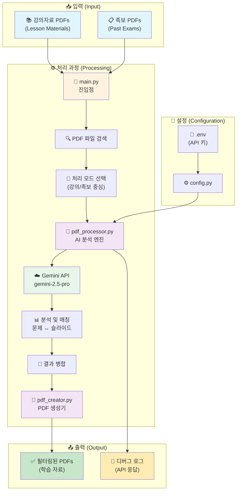
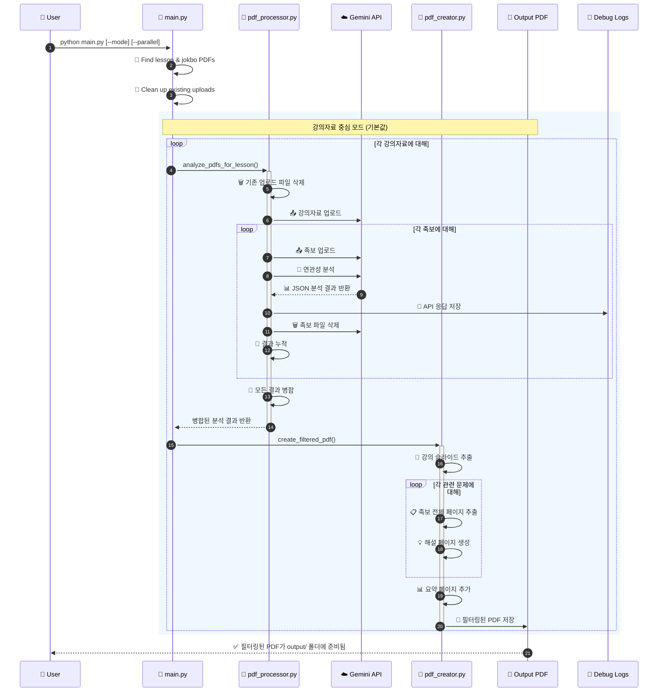
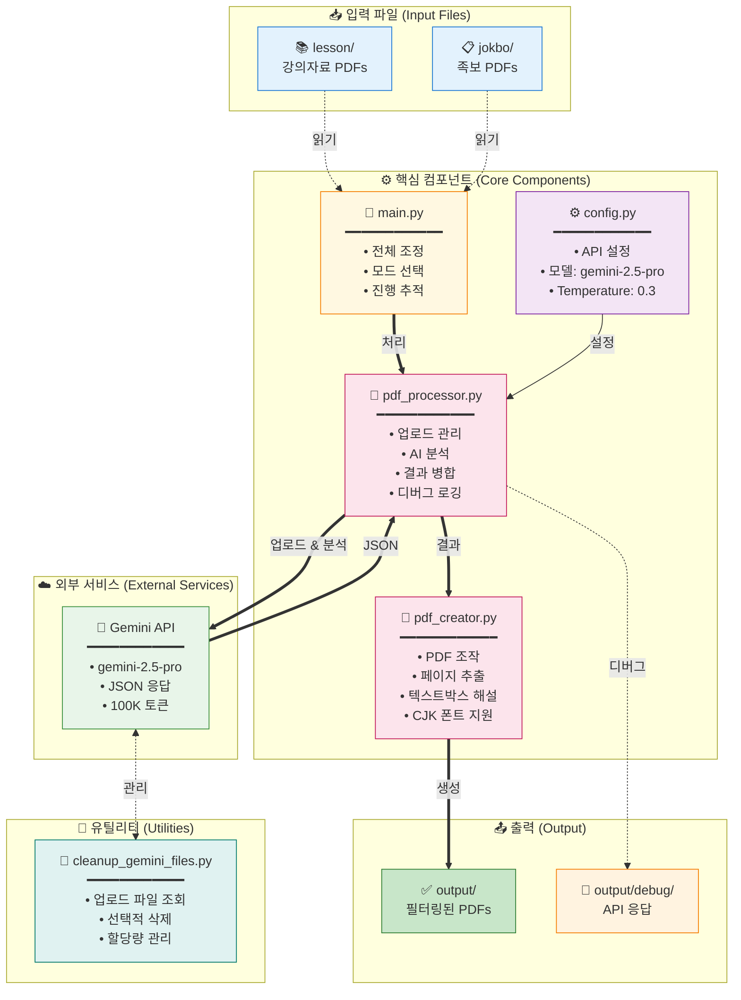
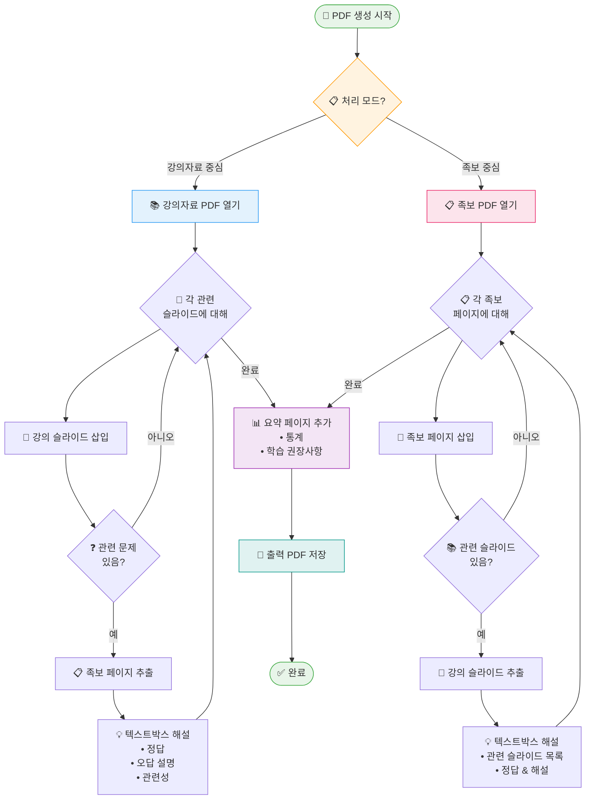

# PDF Processing System Architecture (시스템 아키텍처)

## 시스템 개요 (System Overview)



## 상세 데이터 흐름 (Detailed Data Flow)



## 컴포넌트 구조 (Component Architecture)



## PDF 생성 프로세스 (PDF Creation Process)



## Gemini API 설정 (Configuration)

### 모델 설정 (Model Settings)

```python
GENERATION_CONFIG = {
    "temperature": 0.3,          # Low temperature for consistent results
    "top_p": 0.95,              # Nucleus sampling parameter
    "top_k": 40,                # Top-k sampling parameter
    "max_output_tokens": 100000, # Maximum output tokens (very high)
    "response_mime_type": "application/json"  # Force JSON response
}

# Available Models:
- gemini-2.5-pro (default) - Highest quality
- gemini-2.5-flash - Faster, cheaper
- gemini-2.5-flash-lite - Fastest, cheapest

# Thinking Budget (Flash/Flash-lite only):
- 0: Disable thinking (fastest)
- 1-24576: Manual budget
- -1: Automatic (model decides)
```

### 안전 설정 (Safety Settings)

모든 안전 카테고리를 `BLOCK_NONE`으로 설정하여 콘텐츠 차단 방지:
- HARM_CATEGORY_HARASSMENT
- HARM_CATEGORY_HATE_SPEECH
- HARM_CATEGORY_SEXUALLY_EXPLICIT
- HARM_CATEGORY_DANGEROUS_CONTENT

### API 사용 패턴 (Usage Pattern)

1. **Upload Pattern**: One lesson PDF + One jokbo PDF at a time
2. **Request Frequency**: Sequential processing (one jokbo at a time)
3. **File Management**: 
   - Clean up all existing uploads before starting
   - Upload files as needed
   - Delete immediately after analysis
   - Retry logic for failed deletions
4. **Error Handling**: Retry logic for file processing states
5. **Debug Support**: All API responses saved to output/debug/ for troubleshooting

### 토큰 제한 및 제약사항 (Token Limits)

- **Max Output Tokens**: 100,000 tokens (configured)
- **Input Size**: Limited by PDF file upload size
- **Processing Time**: 2-second polling interval for file upload status
- **Concurrent Uploads**: Not used - sequential processing only

### 응답 형식 (Response Format)

#### 강의자료 중심 모드 응답 (Lesson-Centric)
```json
{
  "related_slides": [{
    "lesson_page": number,
    "related_jokbo_questions": [{
      "jokbo_filename": string,
      "jokbo_page": number,
      "jokbo_end_page": number,  // For multi-page questions
      "question_number": number,
      "question_text": string,
      "answer": string,
      "explanation": string,
      "wrong_answer_explanations": {
        "1번": "Why option 1 is wrong",
        "2번": "Why option 2 is wrong",
        "3번": "Why option 3 is wrong",
        "4번": "Why option 4 is wrong"
      },
      "relevance_reason": string
    }],
    "importance_score": 1-10,
    "key_concepts": [string]
  }],
  "summary": {
    "total_related_slides": number,
    "total_questions": number,
    "key_topics": [string],
    "study_recommendations": string
  }
}
```

#### 족보 중심 모드 응답 (Jokbo-Centric)
```json
{
  "jokbo_pages": [{
    "jokbo_page": number,
    "questions": [{
      "question_number": number,
      "question_text": string,
      "answer": string,
      "explanation": string,
      "wrong_answer_explanations": {
        "1번": "...",
        "2번": "...",
        "3번": "...",
        "4번": "..."
      },
      "related_lesson_slides": [{
        "lesson_filename": string,
        "lesson_page": number,
        "relevance_reason": string
      }]
    }]
  }],
  "summary": {
    "total_jokbo_pages": number,
    "total_questions": number,
    "total_related_slides": number,
    "study_recommendations": string
  }
}
```

## Operating Modes (작동 모드)

### 1. Lesson-Centric Mode (강의자료 중심 - 기본값)
- 각 강의자료를 기준으로 모든 족보와 비교
- 출력: `filtered_{강의자료명}_all_jokbos.pdf`
- 용도: 특정 강의의 중요 내용 파악

### 2. Jokbo-Centric Mode (족보 중심)
- 각 족보를 기준으로 모든 강의자료와 비교
- 출력: `jokbo_centric_{족보명}_all_lessons.pdf`
- 용도: 시험 직전 족보 위주 학습
- 구조: 족보 페이지 → 관련 강의 슬라이드들 → AI 해설

### 3. Parallel Processing (병렬 처리)
- ThreadPoolExecutor 사용 (기본 3 workers)
- Pre-upload 방식으로 공통 파일 재사용
- 각 스레드별 독립적인 PDFProcessor 인스턴스

## 주요 기능 (Key Features)

### 1. 스마트 파일 업로드 관리
- 처리 전 모든 업로드 파일 삭제
- 메모리 효율을 위한 순차적 업로드/삭제
- 실패 시 자동 재시도 로직

### 2. 디버그 지원
- 모든 Gemini API 응답을 `output/debug/`에 저장
- 타임스탬프, 파일명, 원본 응답, 파싱 상태 포함
- 문제 해결에 필수적

### 3. 프롬프트 엔지니어링
- 강의자료 내 문제 엄격 제외
- 정확한 페이지/문제 번호 강제
- 일관성을 위한 파일명 보존

### 4. 여러 페이지 문제 지원
- 여러 페이지에 걸친 문제 처리
- 적절한 추출을 위해 `jokbo_end_page` 필드 사용

### 5. 오답 해설 기능
- 각 선택지가 오답인 이유 상세 설명
- 학생들의 일반적인 실수 이해 도움

## Recent Updates (최근 업데이트)

### 2025-07-28
1. **PDF 객체 일관성 버그 수정**
   - `create_jokbo_centric_pdf`에서 캐시된 PDF 메커니즘 사용
   - 페이지 경계 문제 해결 (마지막 문제의 다음 페이지 포함)
   - 디버그 로깅 추가로 페이지 포함 로직 추적 가능

2. **문서 개선**
   - README.md 사용법을 표 형식으로 재구성
   - 시나리오별 최적 설정 추가
   - 명령어 옵션 가독성 향상

### 2025-07-27
1. **Gemini 모델 선택 기능**
   - Pro, Flash, Flash-lite 모델 지원
   - Thinking Budget 설정 옵션 추가
   - 비용/속도 최적화 가능

2. **PyMuPDF Story API 오류 수정**
   - Story.draw() 메서드 TypeError 해결
   - Story 클래스 대신 insert_textbox() 사용
   - PyMuPDF 버전 호환성 문제 해결
   - CJK 폰트로 한글 텍스트 렌더링 개선

### 2025-07-26
1. **파일 업로드 관리 개선**
   - 자동 클린업 기능 추가
   - 메모리 효율성 향상
   
2. **디버깅 기능 강화**
   - API 응답 자동 저장
   - JSON 파싱 검증
   
3. **프롬프트 개선**
   - 강의자료 내 문제 제외 명시
   - 문제 번호 정확성 강화

## Data Flow Comparison (데이터 흐름 비교)

### Lesson-Centric Flow
```
1. For each lesson PDF:
   a. Clean up existing uploads
   b. Upload lesson file
   c. For each jokbo:
      - Upload jokbo
      - Analyze relationship
      - Save debug log
      - Delete jokbo
   d. Merge results
   e. Generate filtered PDF
```

### Jokbo-Centric Flow
```
1. For each jokbo PDF:
   a. Clean up existing uploads
   b. Upload jokbo file
   c. For each lesson:
      - Upload lesson
      - Analyze relationship
      - Save debug log
      - Delete lesson
   d. Merge results
   e. Generate jokbo-centric PDF
```

## Utility Tools (유틸리티)

### cleanup_gemini_files.py
- **목적**: Gemini API 업로드 파일 관리 도구
- **기능**:
  - 업로드된 모든 파일 목록 조회
  - 파일별 상세 정보 표시 (크기, 상태, 생성시간)
  - 선택적 삭제 또는 전체 삭제
  - 대화형 인터페이스
- **사용 시나리오**:
  - 프로그램 오류로 인한 잔여 파일 정리
  - API 할당량 관리
  - 디버깅 후 클린업
```