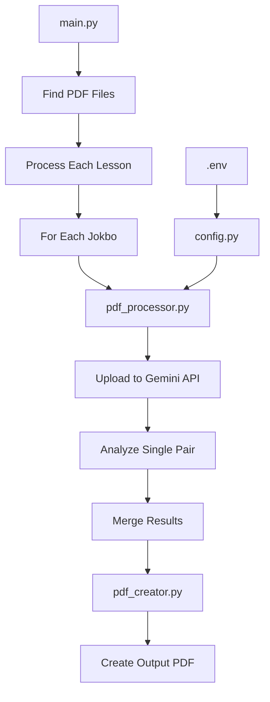
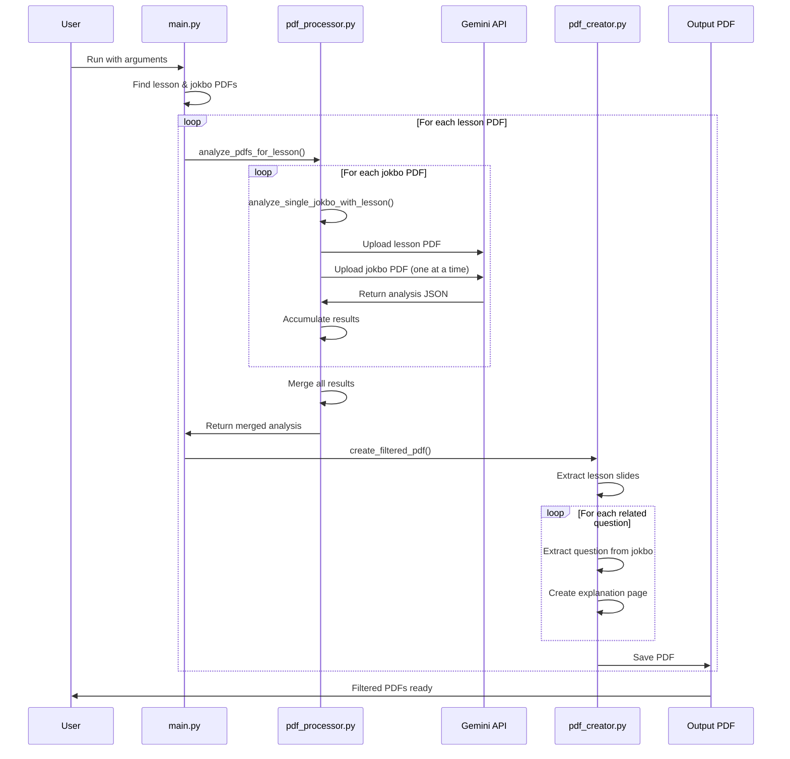
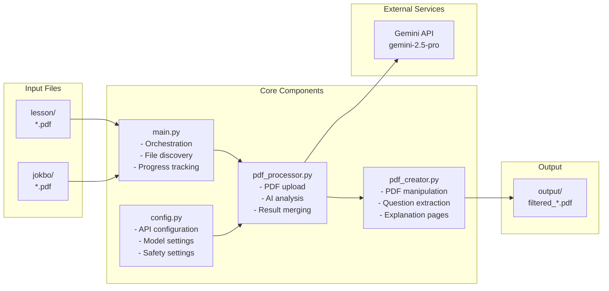
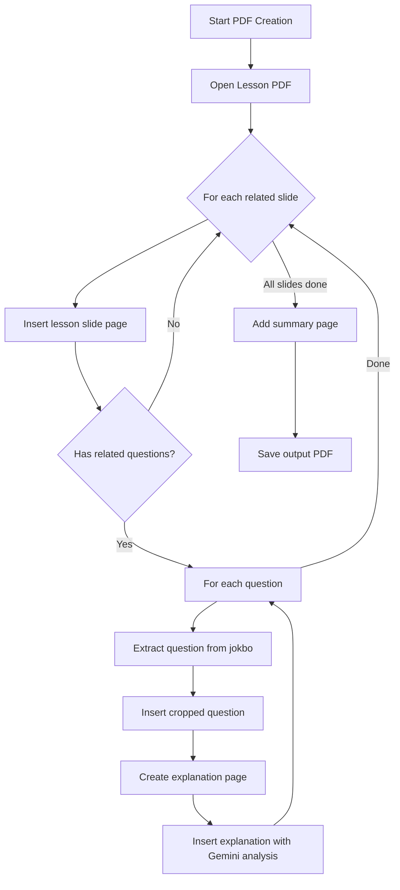

# PDF Processing System Architecture

## System Overview



## Detailed Data Flow



## Component Architecture



## PDF Creation Process



## Gemini API Configuration

### Model Settings (from config.py)

```python
GENERATION_CONFIG = {
    "temperature": 0.3,          # Low temperature for consistent results
    "top_p": 0.95,              # Nucleus sampling parameter
    "top_k": 40,                # Top-k sampling parameter
    "max_output_tokens": 100000, # Maximum output tokens (very high)
    "response_mime_type": "application/json"  # Force JSON response
}

Model: gemini-2.5-pro
```

### Safety Settings

All safety categories are set to `BLOCK_NONE` to prevent content blocking:
- HARM_CATEGORY_HARASSMENT
- HARM_CATEGORY_HATE_SPEECH
- HARM_CATEGORY_SEXUALLY_EXPLICIT
- HARM_CATEGORY_DANGEROUS_CONTENT

### API Usage Pattern

1. **Upload Pattern**: One lesson PDF + One jokbo PDF at a time
2. **Request Frequency**: Sequential processing (one jokbo at a time)
3. **File Management**: Uploaded files are deleted after processing
4. **Error Handling**: Retry logic for file processing states

### Token Limits and Constraints

- **Max Output Tokens**: 100,000 tokens (configured)
- **Input Size**: Limited by PDF file upload size
- **Processing Time**: 2-second polling interval for file upload status
- **Concurrent Uploads**: Not used - sequential processing only

### Response Format

The API is configured to return JSON with this structure:
```json
{
  "related_slides": [{
    "lesson_page": number,
    "related_jokbo_questions": [{
      "jokbo_filename": string,
      "jokbo_page": number,
      "question_number": number,
      "question_text": string,
      "answer": string,
      "explanation": string,
      "relevance_reason": string
    }],
    "importance_score": 1-10,
    "key_concepts": [string]
  }],
  "summary": {
    "total_related_slides": number,
    "total_questions": number,
    "key_topics": [string],
    "study_recommendations": string
  }
}
```