# Architecture Documentation / 아키텍처 문서

## 개요 / Overview

### 시스템 소개 / System Introduction

**한국어**
JokboDude는 의과대학 병리학 과목의 효과적인 학습을 위해 설계된 AI 기반 PDF 처리 시스템입니다. 이 시스템은 과거 시험 문제(족보)와 강의 자료를 분석하여, 학생들이 시험 준비에 필요한 핵심 내용만을 필터링한 맞춤형 학습 자료를 생성합니다.

주요 특징:
- Google Gemini AI API를 활용한 지능형 콘텐츠 분석
- 족보 문제와 강의 슬라이드 간의 관련성 자동 매칭
- 100점 만점 체계의 정밀한 관련성 점수 산출
- 병렬 처리를 통한 고속 분석
- 두 가지 분석 모드 지원 (강의 중심/족보 중심)

**English**
JokboDude is an AI-powered PDF processing system designed for effective learning in medical school pathology courses. The system analyzes past exam questions (jokbo) and lecture materials to generate customized study materials by filtering only the essential content needed for exam preparation.

Key Features:
- Intelligent content analysis using Google Gemini AI API
- Automatic matching between exam questions and lecture slides
- Precise relevance scoring on a 100-point scale
- High-speed analysis through parallel processing
- Support for two analysis modes (lesson-centric/jokbo-centric)

## 시스템 아키텍처 / System Architecture

### 전체 구조도 / Overall Architecture Diagram

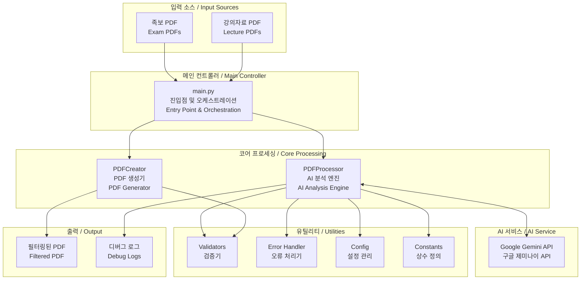

### 기존 시스템 개요도 / Legacy System Overview

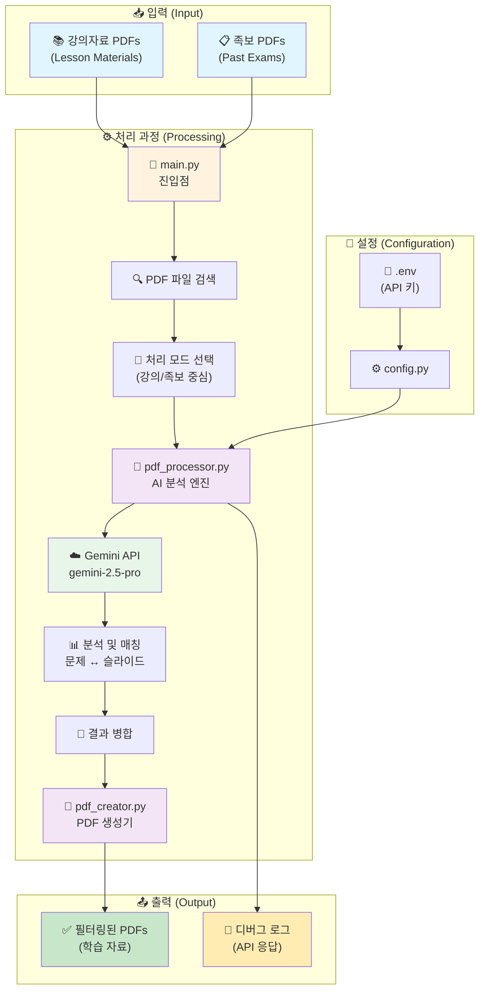

### 데이터 흐름도 / Data Flow Diagram

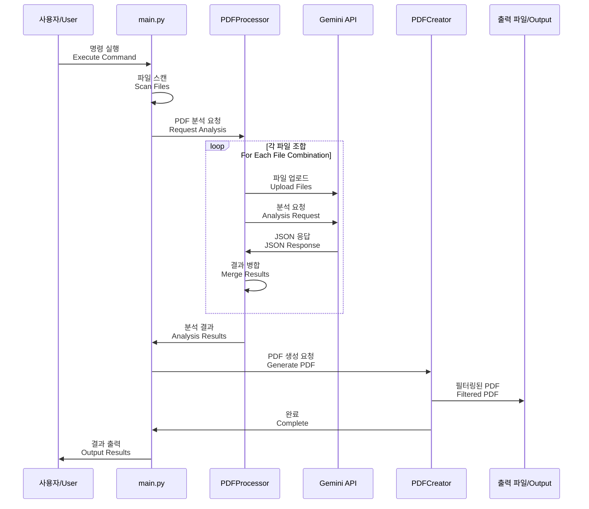

## 핵심 컴포넌트 / Core Components

### 1. main.py - 메인 엔트리 포인트 / Main Entry Point

**한국어**
- **역할**: 전체 프로그램의 진입점 및 워크플로우 오케스트레이션
- **주요 기능**:
  - 명령줄 인자 파싱 (argparse 사용)
  - 처리 모드 선택 (강의 중심 vs 족보 중심)
  - PDF 파일 검색 및 필터링 (Zone.Identifier 파일 제외)
  - 병렬/순차 처리 라우팅
  - 세션 관리 기능 (임시 파일 정리)
  - 진행 상황 모니터링

**English**
- **Role**: Program entry point and workflow orchestration
- **Key Functions**:
  - Command-line argument parsing (using argparse)
  - Processing mode selection (lesson-centric vs jokbo-centric)
  - PDF file discovery and filtering (excluding Zone.Identifier files)
  - Parallel/sequential processing routing
  - Session management (temporary file cleanup)
  - Progress monitoring

### 2. PDFProcessor - AI 분석 엔진 / AI Analysis Engine

**한국어**
- **역할**: Gemini API와의 통신 및 AI 기반 콘텐츠 분석
- **주요 기능**:
  - 파일 업로드/삭제 관리
  - 대용량 PDF 청킹 (40페이지 단위 분할)
  - 병렬 처리 지원 (ThreadPoolExecutor 사용)
  - 지수 백오프 재시도 로직
  - JSON 응답 파싱 및 부분 복구
  - 세션 기반 실행 격리
  - 스레드 안전 PDF 캐싱

**English**
- **Role**: Communication with Gemini API and AI-based content analysis
- **Key Functions**:
  - File upload/deletion management
  - Large PDF chunking (40-page units)
  - Parallel processing support (using ThreadPoolExecutor)
  - Exponential backoff retry logic
  - JSON response parsing and partial recovery
  - Session-based execution isolation
  - Thread-safe PDF caching

### 3. PDFCreator - PDF 생성기 / PDF Generator

**한국어**
- **역할**: 분석 결과를 기반으로 필터링된 PDF 생성
- **주요 기능**:
  - 다중 페이지 문제 추출
  - CJK 폰트를 사용한 한글 텍스트 렌더링
  - 설명 페이지 자동 생성
  - 스레드 안전 PDF 캐싱
  - 문제 번호순 정렬

**English**
- **Role**: Generate filtered PDFs based on analysis results
- **Key Functions**:
  - Multi-page question extraction
  - Korean text rendering using CJK fonts
  - Automatic explanation page generation
  - Thread-safe PDF caching
  - Question number-based sorting

## 상세 데이터 흐름 (Detailed Data Flow)

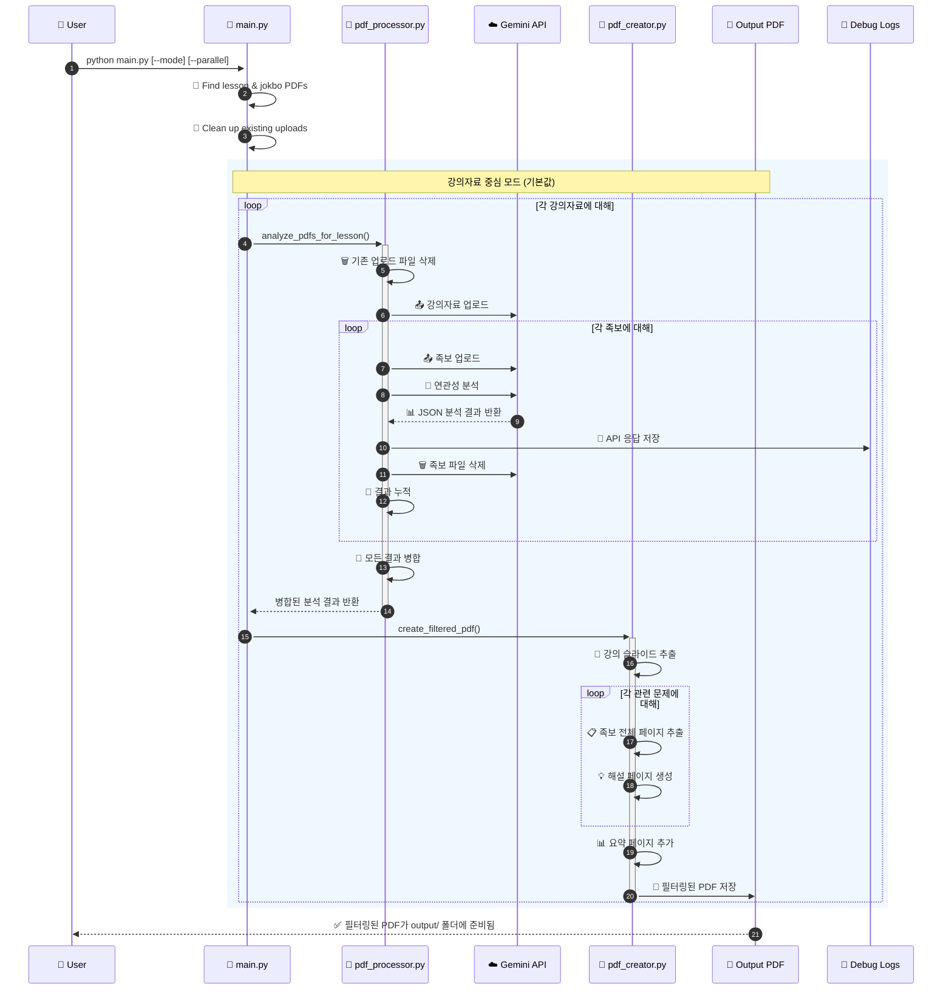

## 컴포넌트 구조 (Component Architecture)

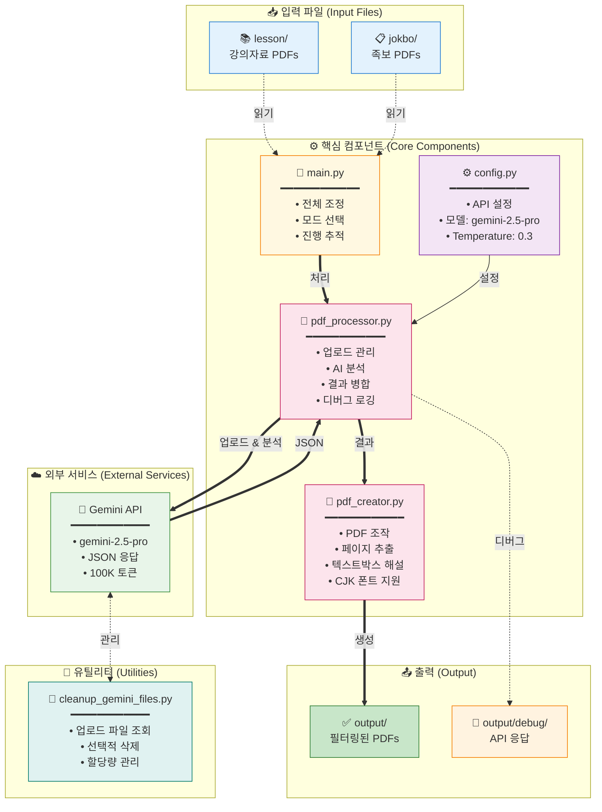

## PDF 생성 프로세스 (PDF Creation Process)


## Gemini API 설정 (Configuration)

### 모델 설정 (Model Settings)

```python
GENERATION_CONFIG = {
    "temperature": 0.3,          # Low temperature for consistent results
    "top_p": 0.95,              # Nucleus sampling parameter
    "top_k": 40,                # Top-k sampling parameter
    "max_output_tokens": 100000, # Maximum output tokens (very high)
    "response_mime_type": "application/json"  # Force JSON response
}

# Available Models:
- gemini-2.5-pro (default) - Highest quality
- gemini-2.5-flash - Faster, cheaper
- gemini-2.5-flash-lite - Fastest, cheapest

# Thinking Budget (Flash/Flash-lite only):
- 0: Disable thinking (fastest)
- 1-24576: Manual budget
- -1: Automatic (model decides)
```

### 안전 설정 (Safety Settings)

모든 안전 카테고리를 `BLOCK_NONE`으로 설정하여 콘텐츠 차단 방지:
- HARM_CATEGORY_HARASSMENT
- HARM_CATEGORY_HATE_SPEECH
- HARM_CATEGORY_SEXUALLY_EXPLICIT
- HARM_CATEGORY_DANGEROUS_CONTENT

### API 사용 패턴 (Usage Pattern)

1. **Upload Pattern**: One lesson PDF + One jokbo PDF at a time
2. **Request Frequency**: Sequential processing (one jokbo at a time)
3. **File Management**: 
   - Clean up all existing uploads before starting
   - Upload files as needed
   - Delete immediately after analysis
   - Retry logic for failed deletions
4. **Error Handling**: Retry logic for file processing states
5. **Debug Support**: All API responses saved to output/debug/ for troubleshooting

### 토큰 제한 및 제약사항 (Token Limits)

- **Max Output Tokens**: 100,000 tokens (configured)
- **Input Size**: Limited by PDF file upload size
- **Processing Time**: 2-second polling interval for file upload status
- **Concurrent Uploads**: Not used - sequential processing only

### 응답 형식 (Response Format)

#### 강의자료 중심 모드 응답 (Lesson-Centric)
```json
{
  "related_slides": [{
    "lesson_page": number,
    "related_jokbo_questions": [{
      "jokbo_filename": string,
      "jokbo_page": number,
      "jokbo_end_page": number,  // For multi-page questions
      "question_number": number,
      "question_text": string,
      "answer": string,
      "explanation": string,
      "wrong_answer_explanations": {
        "1번": "Why option 1 is wrong",
        "2번": "Why option 2 is wrong",
        "3번": "Why option 3 is wrong",
        "4번": "Why option 4 is wrong"
      },
      "relevance_reason": string
    }],
    "importance_score": 1-10,
    "key_concepts": [string]
  }],
  "summary": {
    "total_related_slides": number,
    "total_questions": number,
    "key_topics": [string],
    "study_recommendations": string
  }
}
```

#### 족보 중심 모드 응답 (Jokbo-Centric)
```json
{
  "jokbo_pages": [{
    "jokbo_page": number,
    "questions": [{
      "question_number": number,
      "question_text": string,
      "answer": string,
      "explanation": string,
      "wrong_answer_explanations": {
        "1번": "...",
        "2번": "...",
        "3번": "...",
        "4번": "..."
      },
      "related_lesson_slides": [{
        "lesson_filename": string,
        "lesson_page": number,
        "relevance_reason": string
      }]
    }]
  }],
  "summary": {
    "total_jokbo_pages": number,
    "total_questions": number,
    "total_related_slides": number,
    "study_recommendations": string
  }
}
```

## 처리 모드 / Processing Modes

### 강의 중심 모드 / Lesson-Centric Mode

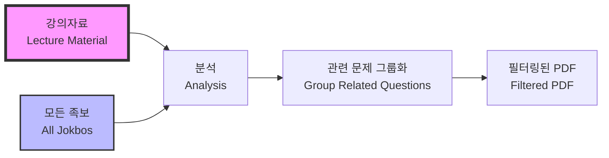

**한국어**
- **목적**: 특정 강의 주제 학습에 최적화
- **프로세스**: 각 강의자료를 기준으로 모든 족보와 비교
- **출력**: 강의 슬라이드 → 관련 시험 문제 → AI 해설
- **사용 시나리오**: 수업 내용 복습, 특정 주제 심화 학습

**English**
- **Purpose**: Optimized for studying specific lecture topics
- **Process**: Compare each lecture material against all jokbos
- **Output**: Lecture slide → Related exam questions → AI explanations
- **Use Cases**: Lecture review, deep dive into specific topics

### 족보 중심 모드 / Jokbo-Centric Mode

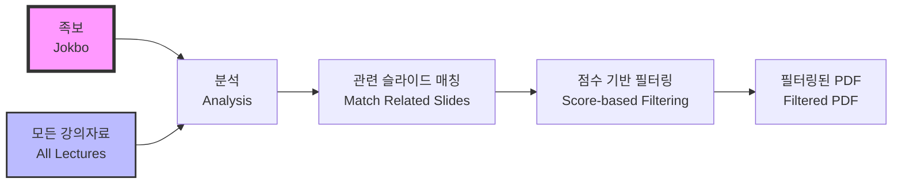

**한국어**
- **목적**: 시험 준비에 최적화
- **프로세스**: 각 족보를 기준으로 모든 강의자료와 비교
- **출력**: 시험 문제 → 관련 강의 슬라이드 → AI 해설
- **특징**:
  - 100점 만점 관련성 점수 시스템
  - 문제당 상위 2개 연결만 선택
  - 최소 50점 이상 연결만 포함

**English**
- **Purpose**: Optimized for exam preparation
- **Process**: Compare each jokbo against all lecture materials
- **Output**: Exam question → Related lecture slides → AI explanations
- **Features**:
  - 100-point relevance scoring system
  - Top 2 connections per question
  - Minimum 50-point threshold filtering

## 관련성 점수 체계 / Relevance Scoring System

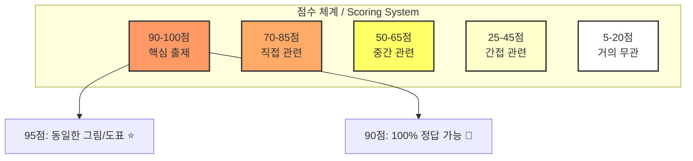

## Operating Modes (작동 모드)

### 1. Lesson-Centric Mode (강의자료 중심 - 기본값)
- 각 강의자료를 기준으로 모든 족보와 비교
- 출력: `filtered_{강의자료명}_all_jokbos.pdf`
- 용도: 특정 강의의 중요 내용 파악

### 2. Jokbo-Centric Mode (족보 중심)
- 각 족보를 기준으로 모든 강의자료와 비교
- 출력: `jokbo_centric_{족보명}_all_lessons.pdf`
- 용도: 시험 직전 족보 위주 학습
- 구조: 족보 페이지 → 관련 강의 슬라이드들 → AI 해설

### 3. Parallel Processing (병렬 처리)
- ThreadPoolExecutor 사용 (기본 3 workers)
- Pre-upload 방식으로 공통 파일 재사용
- 각 스레드별 독립적인 PDFProcessor 인스턴스
- **개선된 안정성 (2025-07-28)**:
  - 스레드 안전 PDF 캐시 (threading.Lock)
  - API 호출 자동 재시도 (지수 백오프)
  - 진행률 표시 (tqdm 통합)
  - 리소스 자동 정리 (finally 블록)

## 주요 기능 (Key Features)

### 1. 스마트 파일 업로드 관리
- 처리 전 모든 업로드 파일 삭제
- 메모리 효율을 위한 순차적 업로드/삭제
- 실패 시 자동 재시도 로직

### 2. 디버그 지원
- 모든 Gemini API 응답을 `output/debug/`에 저장
- 타임스탬프, 파일명, 원본 응답, 파싱 상태 포함
- 문제 해결에 필수적

### 3. 프롬프트 엔지니어링
- 강의자료 내 문제 엄격 제외
- 정확한 페이지/문제 번호 강제
- 일관성을 위한 파일명 보존

### 4. 여러 페이지 문제 지원
- 여러 페이지에 걸친 문제 처리
- 적절한 추출을 위해 `jokbo_end_page` 필드 사용

### 5. 오답 해설 기능
- 각 선택지가 오답인 이유 상세 설명
- 학생들의 일반적인 실수 이해 도움

## Recent Updates (최근 업데이트)

### 2025-07-28
1. **병렬 처리 모드 대규모 개선**
   - 족보 중심 병렬 모드의 `all_connections` 미정의 버그 수정
   - PDF 캐시에 스레드 안전성 추가 (threading.Lock)
   - API 호출 실패 시 자동 재시도 로직 구현
   - tqdm을 통한 실시간 진행률 표시
   - 스레드별 리소스 정리로 메모리 누수 방지
   - 중심 파일 삭제 조정으로 경쟁 상태 해결

2. **PDF 객체 일관성 버그 수정**
   - `create_jokbo_centric_pdf`에서 캐시된 PDF 메커니즘 사용
   - 페이지 경계 문제 해결 (마지막 문제의 다음 페이지 포함)
   - 디버그 로깅 추가로 페이지 포함 로직 추적 가능

3. **문서 개선**
   - README.md 사용법을 표 형식으로 재구성
   - 시나리오별 최적 설정 추가
   - 명령어 옵션 가독성 향상
   - 병렬 모드 개선사항 문서화

### 2025-07-27
1. **Gemini 모델 선택 기능**
   - Pro, Flash, Flash-lite 모델 지원
   - Thinking Budget 설정 옵션 추가
   - 비용/속도 최적화 가능

2. **PyMuPDF Story API 오류 수정**
   - Story.draw() 메서드 TypeError 해결
   - Story 클래스 대신 insert_textbox() 사용
   - PyMuPDF 버전 호환성 문제 해결
   - CJK 폰트로 한글 텍스트 렌더링 개선

### 2025-07-26
1. **파일 업로드 관리 개선**
   - 자동 클린업 기능 추가
   - 메모리 효율성 향상
   
2. **디버깅 기능 강화**
   - API 응답 자동 저장
   - JSON 파싱 검증
   
3. **프롬프트 개선**
   - 강의자료 내 문제 제외 명시
   - 문제 번호 정확성 강화

## Data Flow Comparison (데이터 흐름 비교)

### Lesson-Centric Flow
```
1. For each lesson PDF:
   a. Clean up existing uploads
   b. Upload lesson file
   c. For each jokbo:
      - Upload jokbo
      - Analyze relationship
      - Save debug log
      - Delete jokbo
   d. Merge results
   e. Generate filtered PDF
```

### Jokbo-Centric Flow
```
1. For each jokbo PDF:
   a. Clean up existing uploads
   b. Upload jokbo file
   c. For each lesson:
      - Upload lesson
      - Analyze relationship
      - Save debug log
      - Delete lesson
   d. Merge results
   e. Generate jokbo-centric PDF
```

## 유틸리티 도구 / Utility Tools

### cleanup_gemini_files.py - API 파일 관리 / API File Management

**한국어**
- **목적**: Gemini API에 업로드된 파일 관리
- **기능**:
  - 업로드된 모든 파일 목록 조회
  - 파일별 상세 정보 표시 (크기, 상태, 생성시간)
  - 선택적 삭제 또는 전체 삭제
  - 대화형 인터페이스
- **사용 시나리오**:
  - 프로그램 오류로 인한 잔여 파일 정리
  - API 할당량 관리
  - 디버깅 후 클린업

**English**
- **Purpose**: Manage files uploaded to Gemini API
- **Features**:
  - List all uploaded files
  - Display detailed file information (size, status, creation time)
  - Selective or bulk deletion
  - Interactive interface
- **Use Cases**:
  - Clean up residual files from program errors
  - API quota management
  - Post-debugging cleanup

### cleanup_sessions.py - 세션 관리 / Session Management

**한국어**
- **목적**: 임시 세션 파일 관리 및 정리
- **기능**:
  - 세션 목록 표시 (크기, 생성일, 상태)
  - 오래된 세션 자동 정리
  - 선택적 또는 일괄 삭제
- **명령어**:
  ```bash
  python cleanup_sessions.py           # 대화형 모드
  python main.py --list-sessions      # 세션 목록
  python main.py --cleanup-old 7      # 7일 이상 된 세션 삭제
  ```

**English**
- **Purpose**: Manage and clean up temporary session files
- **Features**:
  - Display session list (size, creation date, status)
  - Automatic cleanup of old sessions
  - Selective or bulk deletion
- **Commands**:
  ```bash
  python cleanup_sessions.py           # Interactive mode
  python main.py --list-sessions      # List sessions
  python main.py --cleanup-old 7      # Delete sessions older than 7 days
  ```

### recover_from_chunks.py - 중단된 작업 복구 / Interrupted Work Recovery

**한국어**
- **목적**: 중단된 PDF 생성 작업 복구
- **기능**:
  - 청크 파일에서 결과 복구
  - 세션별 복구 지원
  - 중단 지점부터 재시작
- **명령어**:
  ```bash
  python recover_from_chunks.py --list-sessions    # 복구 가능한 세션 목록
  python recover_from_chunks.py --session SESSION_ID  # 특정 세션 복구
  ```

**English**
- **Purpose**: Recover interrupted PDF generation tasks
- **Features**:
  - Recover results from chunk files
  - Session-aware recovery support
  - Resume from interruption point
- **Commands**:
  ```bash
  python recover_from_chunks.py --list-sessions    # List recoverable sessions
  python recover_from_chunks.py --session SESSION_ID  # Recover specific session
  ```

## 성능 최적화 / Performance Optimizations

### 병렬 처리 아키텍처 / Parallel Processing Architecture

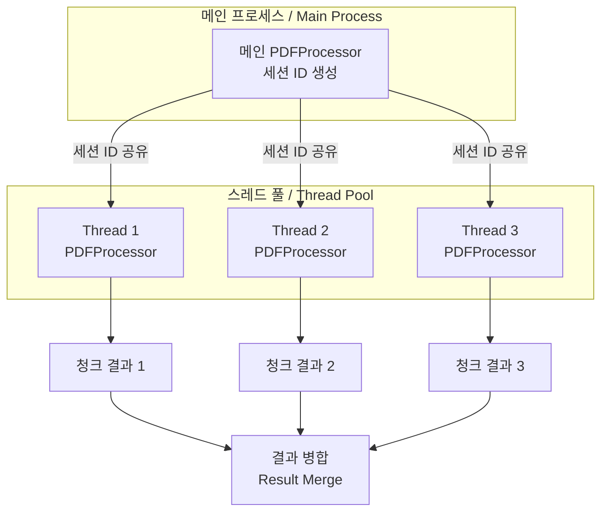

**한국어**
- **단일 세션 사용**: 모든 스레드가 동일한 세션 ID 공유
- **파일 기반 중간 저장**: 메모리 사용량 최소화
- **청크 단위 처리**: 대용량 파일을 40페이지 단위로 분할
- **캐싱 메커니즘**: PDF 객체 재사용으로 I/O 감소
- **진행률 표시**: tqdm을 통한 실시간 진행 상황 모니터링

**English**
- **Single Session Usage**: All threads share the same session ID
- **File-based Intermediate Storage**: Minimize memory usage
- **Chunk-based Processing**: Split large files into 40-page units
- **Caching Mechanism**: Reduce I/O through PDF object reuse
- **Progress Display**: Real-time progress monitoring via tqdm

## 디렉토리 구조 / Directory Structure

```
jokbodude/
├── jokbo/                    # 족보 PDF 파일 / Exam PDF files
├── lesson/                   # 강의자료 PDF 파일 / Lecture PDF files
├── output/                   # 출력 디렉토리 / Output directory
│   ├── debug/               # 디버그 로그 / Debug logs
│   └── temp/                # 임시 파일 / Temporary files
│       └── sessions/        # 세션별 디렉토리 / Session directories
├── main.py                  # 메인 진입점 / Main entry point
├── pdf_processor.py         # AI 분석 엔진 / AI analysis engine
├── pdf_creator.py           # PDF 생성기 / PDF generator
├── config.py               # 설정 관리 / Configuration
├── constants.py            # 상수 정의 / Constants
├── validators.py           # 검증 유틸리티 / Validation utilities
├── pdf_processor_helpers.py # 헬퍼 함수 / Helper functions
└── error_handler.py        # 오류 처리 / Error handling
```

## 환경 설정 / Environment Setup

### 필수 환경 변수 / Required Environment Variables

```bash
GEMINI_API_KEY=your_api_key_here  # Google Gemini API 키 / API Key
MAX_PAGES_PER_CHUNK=40            # 청크당 최대 페이지 수 / Max pages per chunk
```

### 모델 선택 옵션 / Model Selection Options

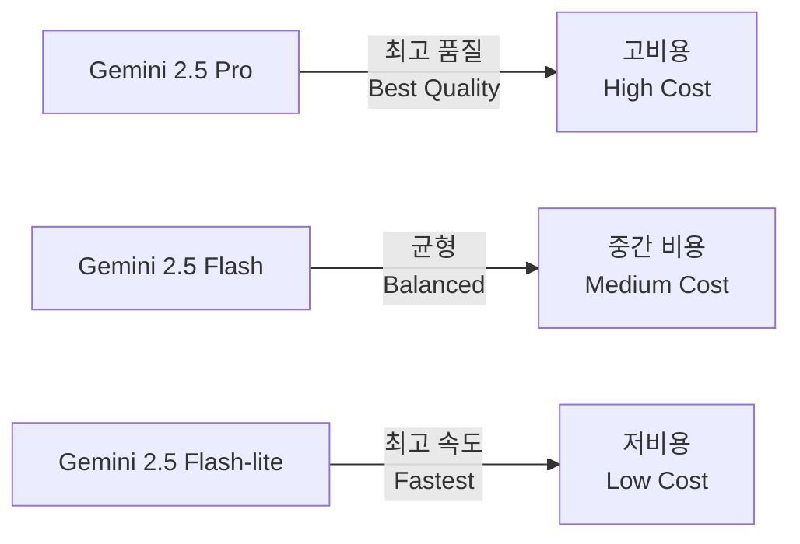

## API 상호작용 / API Interactions

### Gemini API 통신 흐름 / Gemini API Communication Flow

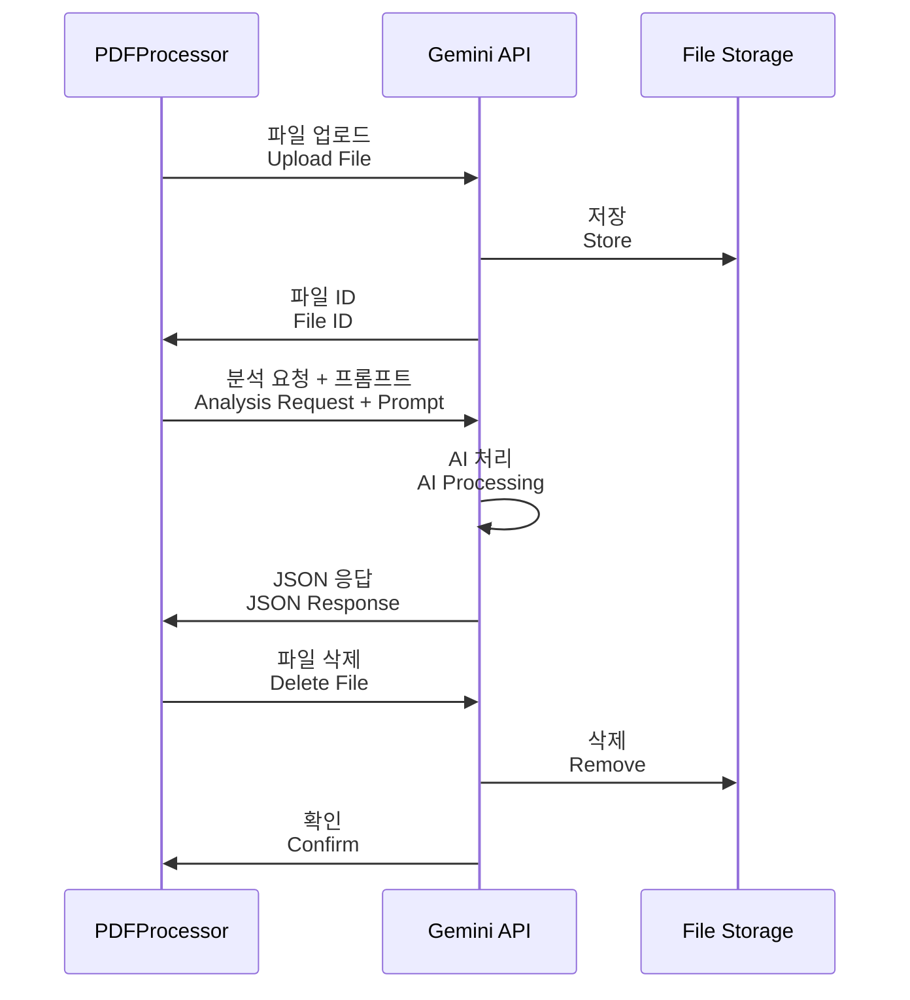

## 주요 설계 결정 / Key Design Decisions

### 1. 청킹 전략 / Chunking Strategy

**한국어**
- **결정**: 40페이지 단위 분할 (환경 변수로 조정 가능)
- **이유**: Gemini API 제한 및 메모리 효율성 고려
- **영향**: 대용량 PDF 처리 가능, 부분 실패 시 재시도 용이

**English**
- **Decision**: 40-page unit splitting (configurable via environment variable)
- **Rationale**: Gemini API limits and memory efficiency
- **Impact**: Enable large PDF processing, easy retry on partial failures

### 2. 스레드 안전성 / Thread Safety

**한국어**
- **결정**: threading.Lock을 사용한 PDF 캐시 보호
- **이유**: 병렬 처리 시 동시 접근 문제 방지
- **구현**: PDFCreator의 get_jokbo_pdf 메서드에 락 적용

**English**
- **Decision**: PDF cache protection using threading.Lock
- **Rationale**: Prevent concurrent access issues during parallel processing
- **Implementation**: Lock applied to PDFCreator's get_jokbo_pdf method

### 3. 세션 관리 / Session Management

**한국어**
- **결정**: 타임스탬프 + 랜덤 문자열 기반 세션 ID
- **이유**: 처리 격리 및 디버깅 용이성
- **특징**: 병렬 처리 시 단일 세션 공유로 리소스 효율성 향상

**English**
- **Decision**: Session ID based on timestamp + random string
- **Rationale**: Processing isolation and debugging ease
- **Feature**: Resource efficiency through single session sharing in parallel processing

### 4. 오류 처리 전략 / Error Handling Strategy

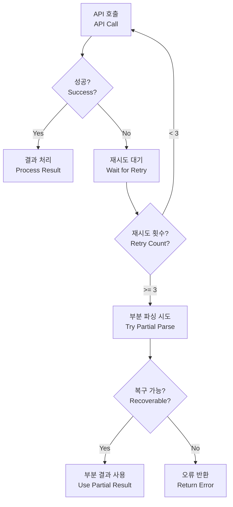

## 향후 고려사항 / Future Considerations

### 확장성 / Scalability

**한국어**
- Context Caching 구현으로 API 비용 절감
- 비동기 처리 (async/await) 도입 검토
- 분산 처리 시스템으로 확장 가능성
- 웹 기반 인터페이스 추가

**English**
- Cost reduction through Context Caching implementation
- Consider introducing asynchronous processing (async/await)
- Potential expansion to distributed processing system
- Addition of web-based interface

### 성능 개선 / Performance Improvements

**한국어**
- GPU 가속 PDF 렌더링
- 더 정교한 캐싱 메커니즘
- 증분 처리 (변경된 파일만 재처리)
- 실시간 진행률 웹소켓 지원

**English**
- GPU-accelerated PDF rendering
- More sophisticated caching mechanisms
- Incremental processing (reprocess only changed files)
- Real-time progress via WebSocket support

## 결론 / Conclusion

**한국어**
JokboDude는 의과대학생들의 효과적인 시험 준비를 위해 설계된 강력한 AI 기반 학습 도구입니다. 모듈화된 아키텍처, 병렬 처리 능력, 그리고 정교한 관련성 점수 시스템을 통해 학습 효율성을 극대화합니다. 시스템의 확장 가능한 설계는 향후 다양한 기능 추가와 성능 개선을 용이하게 합니다.

**English**
JokboDude is a powerful AI-based learning tool designed for effective exam preparation for medical students. Through its modular architecture, parallel processing capabilities, and sophisticated relevance scoring system, it maximizes learning efficiency. The system's scalable design facilitates future feature additions and performance improvements.