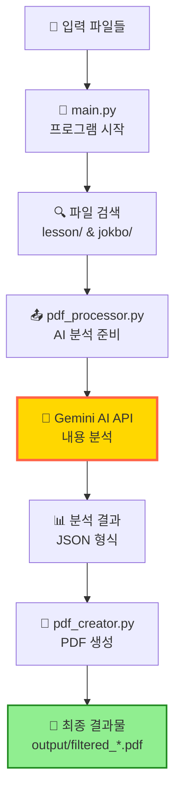
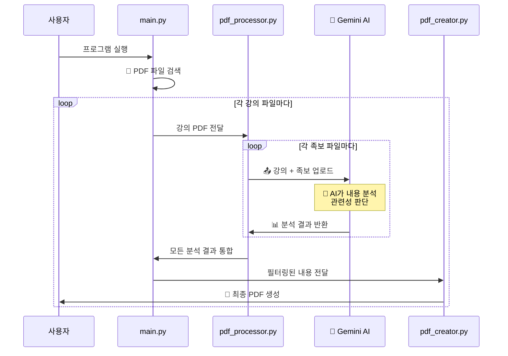
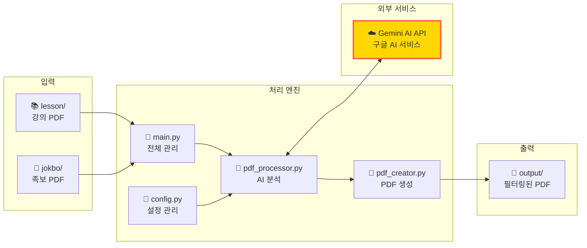

# 시스템 구조 설명서

## 🎯 시스템 개요

이 시스템은 의대 강의 자료(PDF)와 족보(시험 기출문제) PDF를 비교 분석하여, 시험과 관련된 강의 슬라이드만 추출해주는 프로그램입니다. Google의 AI (Gemini)를 활용하여 내용을 분석합니다.

## 📊 작동 흐름

### 1. 전체 시스템 구조



### 2. 상세 처리 과정



### 3. 단계별 설명

1. **파일 준비** 📁
   - `lesson/` 폴더: 강의 자료 PDF 파일들
   - `jokbo/` 폴더: 족보(기출문제) PDF 파일들

2. **AI 분석** 🤖
   - 각 강의 파일마다 모든 족보 파일과 1:1로 비교
   - Gemini AI가 슬라이드와 문제의 연관성 분석
   - 중요도 점수(1-10점) 부여

3. **결과 생성** 📊
   - 관련된 강의 슬라이드만 추출
   - 해당 족보 문제 페이지 포함
   - AI가 작성한 상세 해설 추가
   - `output/` 폴더에 저장

## 🔧 주요 구성 요소

### 핵심 파일들과 역할



1. **main.py** 🚀 - 프로그램 실행 담당
   - PDF 파일 찾기
   - 처리 과정 관리
   - 진행 상황 표시

2. **pdf_processor.py** 🤖 - AI 분석 담당
   - PDF를 Gemini API로 전송
   - 슬라이드-문제 매칭 분석
   - 결과 데이터 정리

3. **pdf_creator.py** 📝 - PDF 생성 담당
   - 관련 슬라이드 추출
   - 족보 문제 페이지 추출
   - 해설 페이지 생성
   - 최종 PDF 제작

4. **config.py** 🔧 - 설정 관리
   - Gemini API 설정
   - 환경 변수 관리

## 📁 결과물 구조

생성되는 PDF 파일(`filtered_강의명_all_jokbos.pdf`)의 구성:

```
📄 필터링된 PDF
├── 📑 관련 강의 슬라이드 1
├── 📑 연관된 족보 문제 페이지
├── 📑 AI 해설 (정답 + 오답 설명)
├── 📑 관련 강의 슬라이드 2
├── 📑 연관된 족보 문제 페이지
├── 📑 AI 해설
└── 📑 요약 통계 페이지
```

## ⚡ 병렬 처리 기능

`--parallel` 옵션 사용 시 더 빠른 처리:
- 여러 족보 파일을 동시에 분석
- 강의 파일은 한 번만 업로드
- 처리 시간 대폭 단축

## 🎨 주요 특징

1. **정확한 매칭**
   - 1:1 문제-슬라이드 매핑
   - 이미지 포함 문제 우선 매칭 (중요도 9-10점)
   - 직접 관련된 내용만 추출

2. **상세한 해설**
   - 정답과 정답 이유
   - 각 오답이 틀린 이유 설명
   - 강의 내용과의 연관성 설명

3. **다중 페이지 지원**
   - 여러 페이지에 걸친 문제도 완전히 추출
   - 이미지와 표 등 모든 내용 보존

## 💡 활용 팁

1. **폴더 구조 준비**
   ```
   pathology/
   ├── jokbo/     (족보 PDF 넣기)
   ├── lesson/    (강의 PDF 넣기)
   └── output/    (결과물 생성됨)
   ```

2. **효과적인 사용법**
   - 같은 과목의 족보와 강의를 매칭
   - 병렬 처리로 시간 단축 (`--parallel`)
   - 특정 강의만 처리 (`--single-lesson`)

3. **결과물 활용**
   - 시험 직전 핵심 내용만 복습
   - 오답 설명으로 실수 방지
   - 중요도 점수로 우선순위 파악