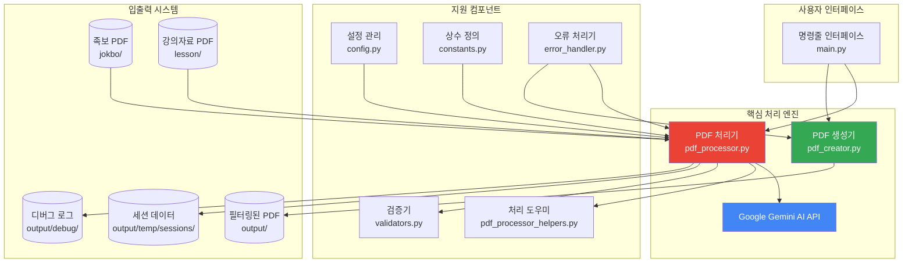
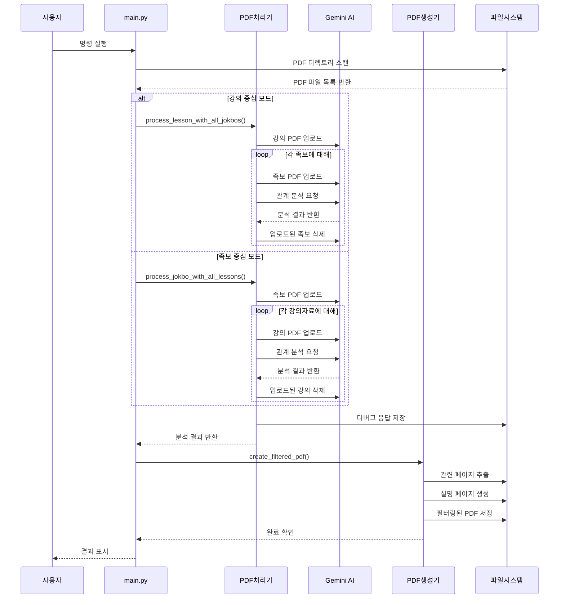
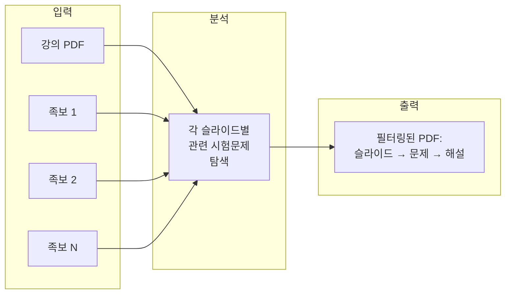
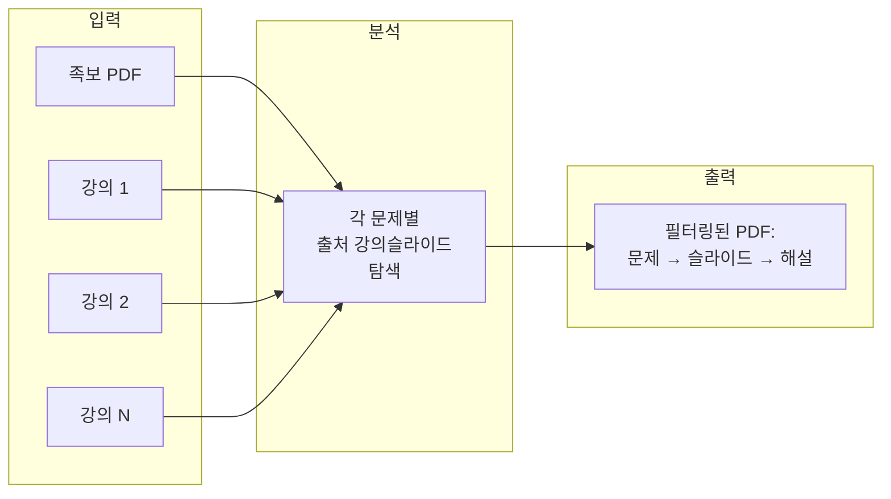
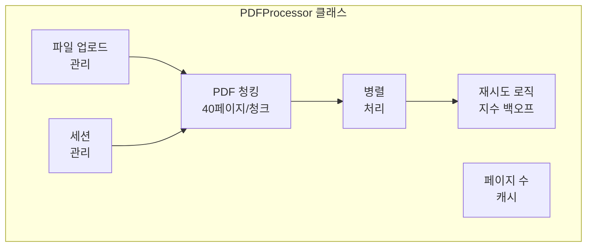
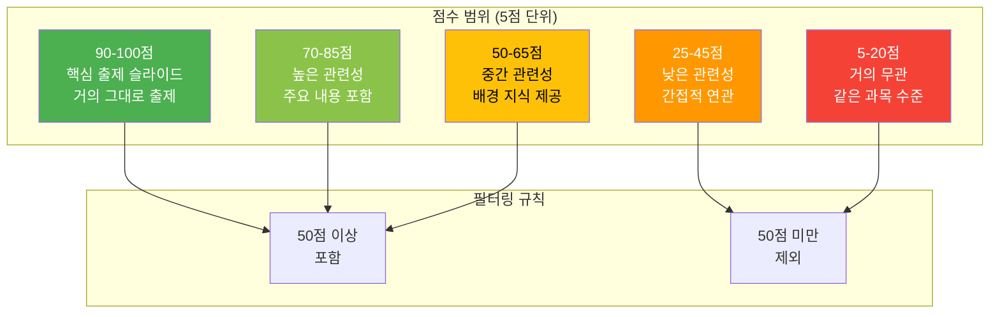
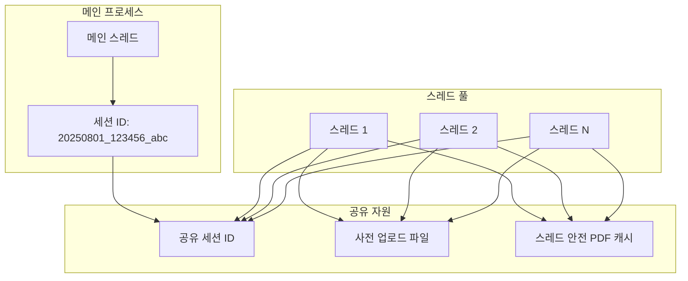
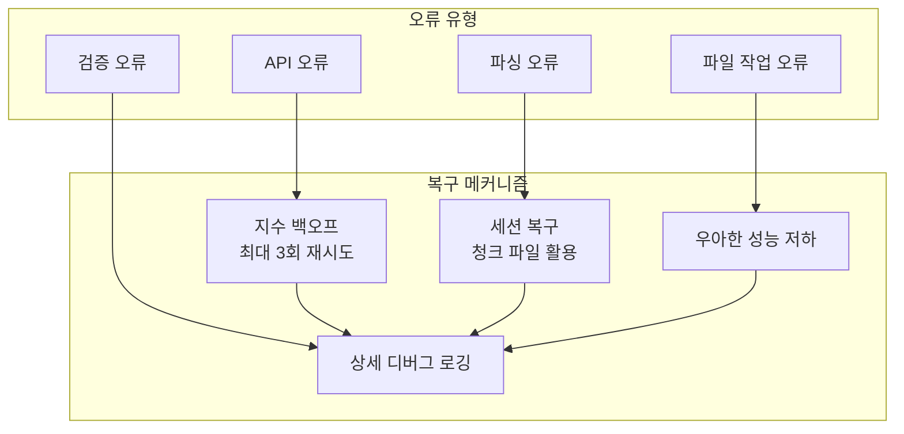
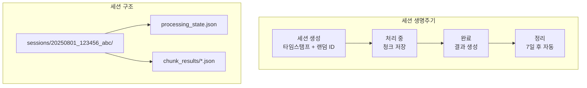
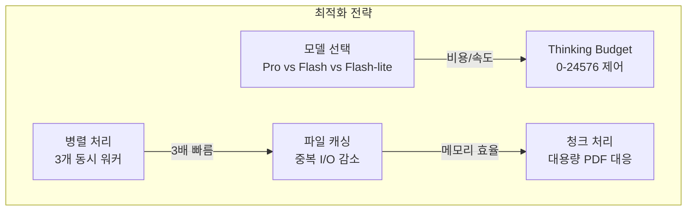

# 아키텍처 문서

## 개요

족보듀드(JokboDude)는 Google Gemini AI API를 활용하여 시험 문제(족보)를 기반으로 강의 자료를 지능적으로 필터링하는 PDF 처리 시스템입니다. 본 시스템은 강의 슬라이드와 기출 문제 간의 연관성을 심층 분석하여, 학습에 가장 효과적인 자료만을 선별한 맞춤형 PDF를 생성합니다.

### 주요 특징
- **AI 기반 분석**: Google Gemini 2.5 모델을 활용한 정확한 연관성 분석
- **이중 처리 모드**: 강의 중심 및 족보 중심 분석 지원
- **병렬 처리**: 다중 스레드를 활용한 고속 처리
- **지능형 점수 시스템**: 100점 만점의 정밀한 관련성 평가

## 시스템 아키텍처



## 컴포넌트 상호작용 흐름



## 처리 모드 상세 설명

### 1. 강의 중심 모드 (기본값)



**활용 목적**: 
- 특정 강의 주제를 깊이 있게 학습
- 각 슬라이드가 어떤 시험 문제로 출제되었는지 파악
- 강의 내용의 중요도 판단

**출력 구조**:
1. 강의 슬라이드 (원본)
2. 관련 족보 문제들
3. AI 생성 해설 및 오답 설명

### 2. 족보 중심 모드



**활용 목적**:
- 시험 대비 집중 학습
- 각 문제의 출제 근거 파악
- 출제 빈도가 높은 슬라이드 식별

**출력 구조**:
1. 족보 문제 (원본)
2. 관련 강의 슬라이드들 (관련성 점수순)
3. AI 생성 해설 및 학습 포인트

## 주요 컴포넌트 상세 분석

### 1. 메인 진입점 (main.py)


**주요 기능**:
- **지능형 파일 탐색**: Zone.Identifier 등 시스템 파일 자동 제외
- **유연한 처리 모드**: 사용자 요구에 따른 분석 방식 선택
- **세션 기반 관리**: 처리 상태 추적 및 복구 지원
- **자동 정리 기능**: 오래된 세션 자동 삭제 (기본 7일)

### 2. PDF 처리기 (pdf_processor.py)



**핵심 기능**:
- **지능형 청킹**: 대용량 PDF를 40페이지 단위로 분할 처리
- **스레드 안전 캐싱**: 동시 접근 시에도 안전한 PDF 메타데이터 관리
- **세션 기반 처리**: 고유 ID로 각 처리 작업 추적
- **강력한 오류 처리**: 3회 재시도 및 지수 백오프
- **상세 디버그 로깅**: 모든 API 응답을 타임스탬프와 함께 저장

### 3. PDF 생성기 (pdf_creator.py)


**핵심 기능**:
- **다중 페이지 문제 처리**: 페이지 경계를 넘는 문제 자동 감지
- **한글 완벽 지원**: CJK 폰트를 활용한 깔끔한 텍스트 렌더링
- **스레드 안전 설계**: 락을 활용한 동시성 제어
- **지능형 페이지 포함**: 마지막 문제의 연속 페이지 자동 포함

### 4. 설정 관리 (config.py)

**모델 선택 옵션**:
- **Pro**: 최고 품질, 복잡한 분석에 적합
- **Flash**: 속도와 품질의 균형
- **Flash-lite**: 최고 속도, 최저 비용

**주요 설정**:
- Temperature: 0.3 (일관된 결과를 위한 낮은 창의성)
- Max Output Tokens: 100,000 (대용량 분석 결과 지원)
- Response Type: JSON (구조화된 데이터 처리)

### 5. 상수 정의 (constants.py)

**프롬프트 템플릿 구조**:
- 공통 소개 및 주의사항
- 모드별 특화 작업 지시
- 출력 형식 명세
- 관련성 점수 기준

## 관련성 점수 시스템



**점수 부여 원칙**:
1. **극히 엄격한 기준 적용**: 90점 이상은 정말 확실한 경우만
2. **5점 단위 부여**: 일관성 있는 평가
3. **50점 최소 기준**: 낮은 관련성은 자동 제외
4. **다중 평가 요소**: 텍스트, 그림, 개념 등 종합 고려

## 병렬 처리 아키텍처



**성능 향상 효과**:
- **3배 빠른 처리**: 기본 3개 워커 사용
- **API 호출 최적화**: 파일 재사용으로 비용 절감
- **메모리 효율성**: 공유 캐시 활용
- **안정적인 동시성**: 락 기반 동기화

## 오류 처리 및 복구 메커니즘



**복구 전략**:
1. **API 오류**: 2^n초 대기 후 재시도 (최대 3회)
2. **부분 실패**: 성공한 부분만으로 결과 생성
3. **세션 복구**: 중단된 작업을 청크 파일에서 복원
4. **상세 로깅**: 모든 오류를 타임스탬프와 함께 기록

## 세션 관리 시스템



**세션 관리 명령**:
```bash
# 세션 목록 확인
python main.py --list-sessions

# 오래된 세션 정리
python main.py --cleanup-old 3  # 3일 이상된 세션 삭제

# 모든 세션 정리
python main.py --cleanup
```

## 주요 설계 결정 사항

### 1. 청킹 전략
- **40페이지 단위**: API 성능과 메모리 사용의 최적 균형
- **동적 조정 가능**: MAX_PAGES_PER_CHUNK 설정
- **자동 병합**: 청크별 결과를 하나로 통합

### 2. 스레드 안전성
- **PDF 캐시 보호**: threading.Lock으로 동시 접근 제어
- **세션 ID 공유**: 모든 스레드가 하나의 세션 사용
- **독립적 처리기**: 각 스레드별 PDFProcessor 인스턴스

### 3. 메모리 관리
- **즉시 정리**: 사용 완료된 파일 즉시 삭제
- **캐시 활용**: 반복적인 PDF 열기/닫기 방지
- **자동 정리**: 소멸자에서 임시 파일 제거

### 4. 안정성 확보
- **지수 백오프**: API 장애 시 점진적 재시도
- **부분 복구**: 일부 성공 시에도 결과 생성
- **포괄적 로깅**: 문제 추적을 위한 상세 기록

## 유틸리티 스크립트

### cleanup_gemini_files.py
**기능**:
- Gemini에 업로드된 파일 목록 조회
- API 할당량 관리
- 대화형 삭제 인터페이스

### cleanup_sessions.py
**기능**:
- 세션별 크기, 나이, 상태 표시
- 선택적 또는 일괄 삭제
- 공간 사용량 분석

### recover_from_chunks.py
**기능**:
- 중단된 처리 작업 복구
- 청크 파일 기반 재구성
- 세션별 복구 지원

## 성능 최적화 전략



**최적화 팁**:
1. **빠른 처리**: `--model flash-lite --thinking-budget 0`
2. **균형 잡힌 처리**: `--model flash --parallel`
3. **고품질 처리**: `--model pro`

## 사용 시나리오별 권장 설정

### 중간고사 대비
```bash
python main.py --mode jokbo-centric --parallel --model flash
```

### 특정 단원 학습
```bash
python main.py --single-lesson "lesson/특정단원.pdf" --model pro
```

### 대량 처리 (전체 학기)
```bash
python main.py --parallel --model flash-lite --thinking-budget 0
```

## 향후 개선 계획

1. **컨텍스트 캐싱**: 반복 분석 시 비용 절감
2. **비동기 처리**: 더 나은 동시성 지원
3. **웹 인터페이스**: 사용자 친화적 UI
4. **배치 처리 개선**: 대규모 파일 세트 최적화
5. **고급 필터링**: 사용자 정의 규칙 지원

## 기술 요구사항

- **Python 3.8** 이상
- **Google Gemini API 키**
- **필수 라이브러리**:
  - PyMuPDF: PDF 조작
  - ReportLab: PDF 생성
  - python-dotenv: 환경 변수 관리
  - tqdm: 진행률 표시 (선택사항)

## 보안 고려사항

1. **API 키 보호**: 환경 변수 사용 (.env 파일)
2. **임시 파일 관리**: 자동 정리로 데이터 유출 방지
3. **세션 격리**: 다중 사용자 환경 지원
4. **민감 정보 처리**: 메모리에만 보관, 디스크 저장 최소화

## 문제 해결 가이드

### 일반적인 오류와 해결책

1. **API 키 오류**
   - `.env` 파일에 `GEMINI_API_KEY` 설정 확인
   - API 키 유효성 검증

2. **메모리 부족**
   - 청크 크기 감소: `MAX_PAGES_PER_CHUNK = 20`
   - 병렬 워커 수 감소: `--workers 2`

3. **처리 중단**
   - 세션 복구: `python recover_from_chunks.py`
   - 디버그 로그 확인: `output/debug/`

4. **PDF 오류**
   - PDF 파일 무결성 확인
   - PyMuPDF 버전 업데이트

## 성능 벤치마크

**테스트 환경**: 
- 족보 5개 (각 20페이지)
- 강의자료 10개 (각 100페이지)

**처리 시간**:
- 순차 처리: ~15분
- 병렬 처리 (3 워커): ~5분
- Flash-lite + 병렬: ~3분

**API 비용 예상**:
- Pro 모델: ~$0.50/처리
- Flash 모델: ~$0.10/처리
- Flash-lite: ~$0.05/처리